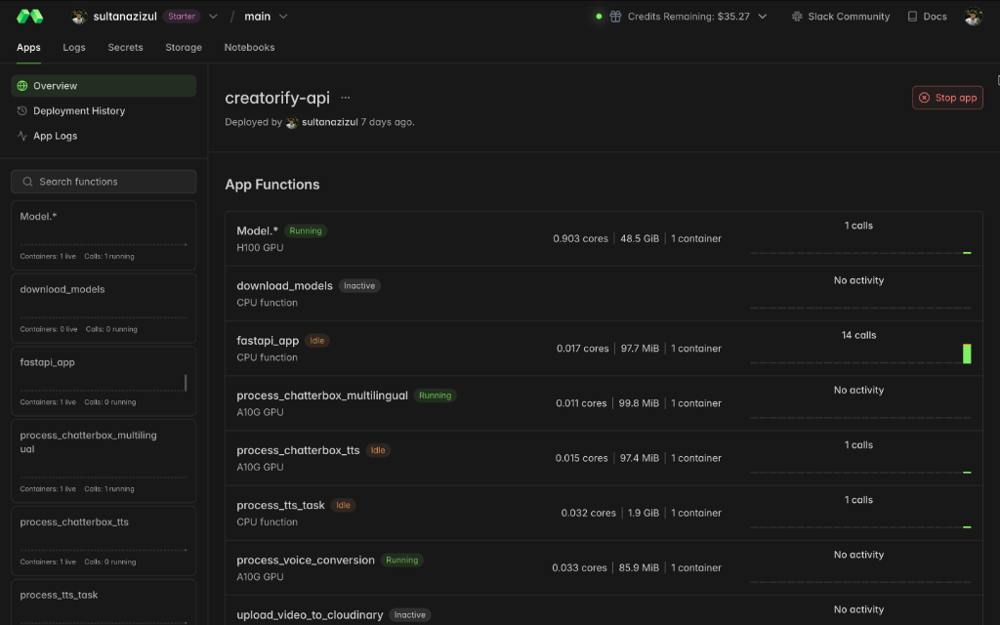
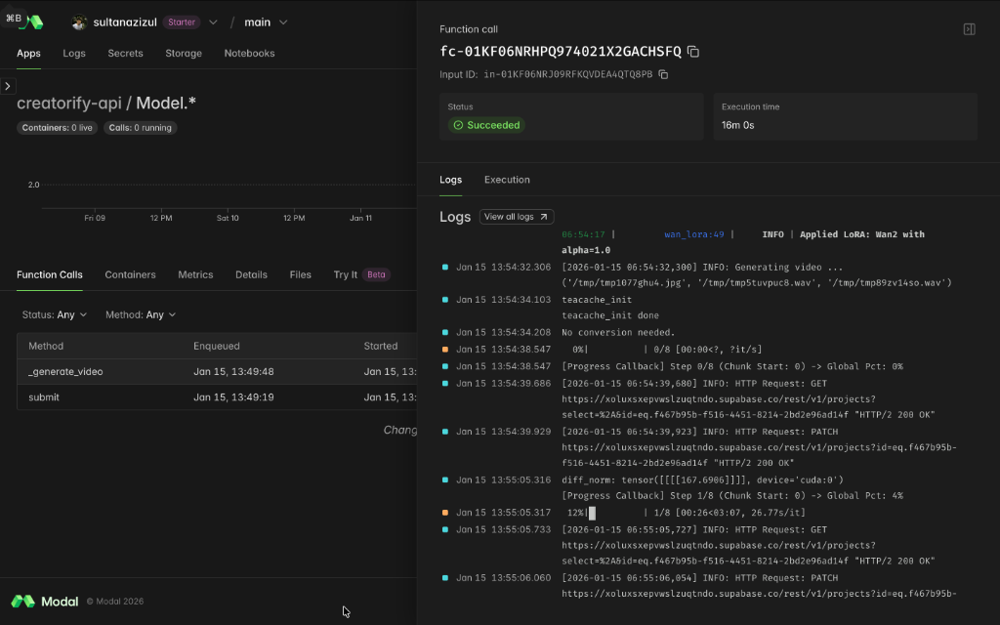
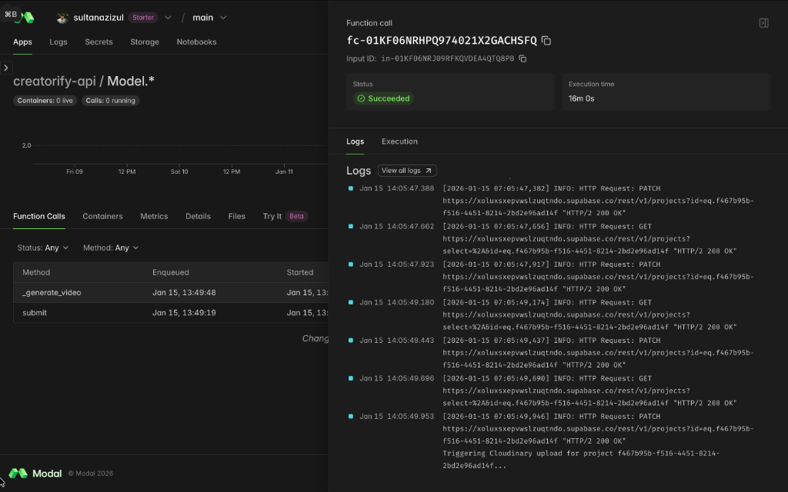
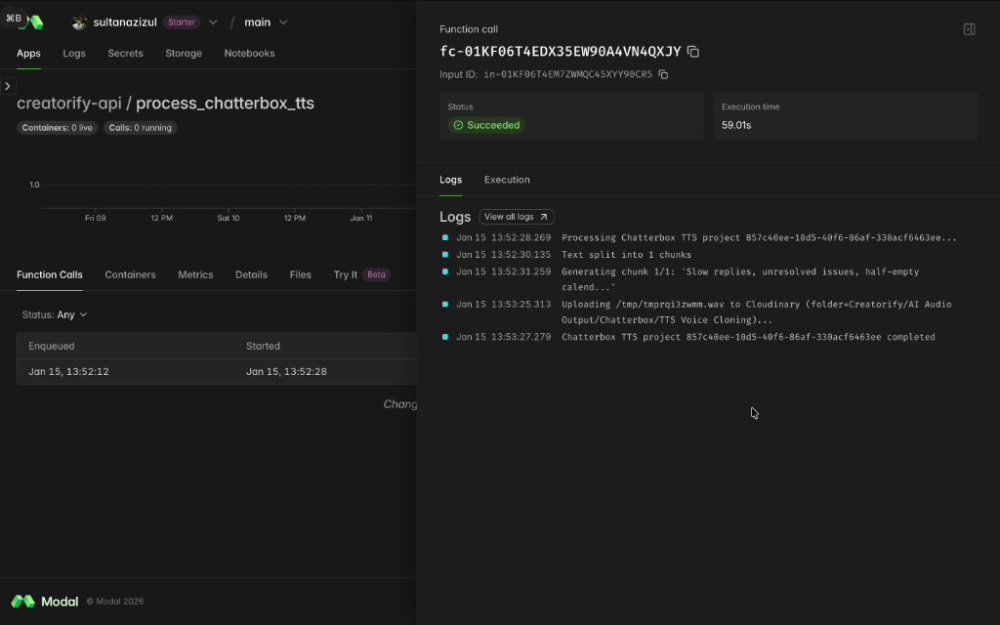
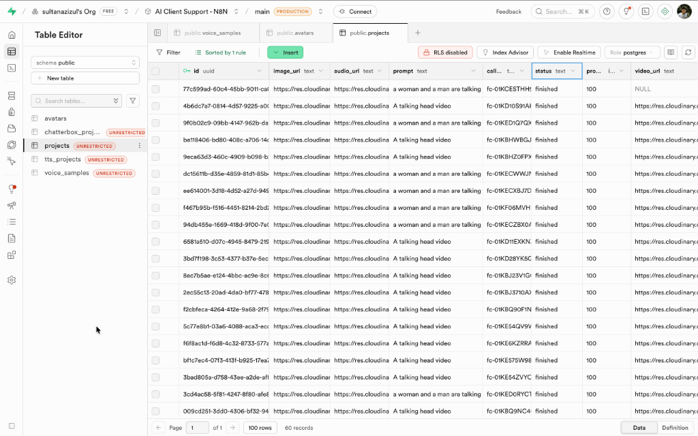
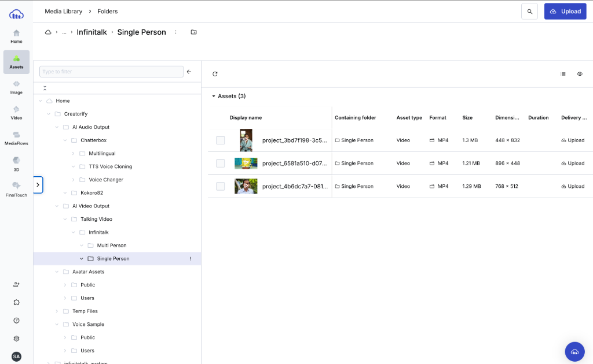
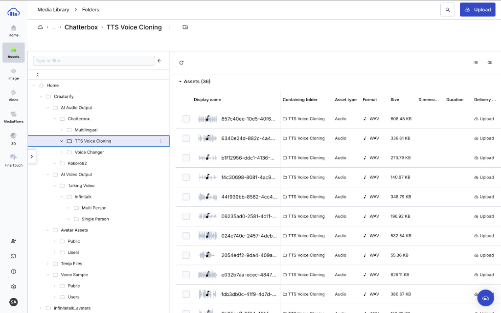

# BAB IV HASIL DAN PEMBAHASAN

## 4.1 Lingkungan Implementasi dan Pengujian
Subbab ini mendeskripsikan spesifikasi lingkungan teknis aktual yang digunakan selama proses pengembangan dan pengujian sistem. Informasi ini penting untuk memastikan hasil pengujian dapat direproduksi (*reproducible*).

### 4.1.1 Perangkat Keras
Perangkat keras yang digunakan dalam penelitian ini terbagi menjadi dua kategori utama. Untuk pengembangan kode dan pengujian lokal, digunakan laptop **MacBook Pro (13-inch, 2020)** dengan prosesor **2.3 GHz Quad-Core Intel Core i7** dan memori (RAM) sebesar **32 GB**. Sedangkan untuk infrastruktur produksi dan inferensi model AI, digunakan **GPU *Worker*** pada platform Modal.com dengan spesifikasi **NVIDIA H100 (80GB VRAM)** untuk model video dan **NVIDIA A10G (24GB VRAM)** untuk model audio.

### 4.1.2 Perangkat Lunak
Perangkat lunak yang digunakan mencakup sistem operasi **macOS** sebagai lingkungan pengembangan lokal dan **Linux** (*containerized*) pada lingkungan *serverless*. Implementasi *backend* dibangun menggunakan bahasa pemrograman **Python 3.10** dengan kerangka kerja **FastAPI** dan *library* **Modal SDK**. Manajemen basis data dan penyimpanan aset media masing-masing menggunakan layanan **Supabase (PostgreSQL)** dan **Cloudinary**. Seluruh kode program ditulis menggunakan **Visual Studio Code (VS Code)**, dan verifikasi fungsionalitas API dilakukan menggunakan aplikasi **Postman**.

## 4.2 Hasil Implementasi Sistem Backend
Bagian ini memaparkan realisasi dari rancangan arsitektur yang telah didefinisikan pada Bab III. Fokus utama adalah pembuktian bahwa desain sistem telah berhasil diterjemahkan menjadi artefak perangkat lunak yang berfungsi.

### 4.2.1 Implementasi API Gateway (FastAPI)
Implementasi API Gateway dibangun menggunakan kerangka kerja **FastAPI** yang bertindak sebagai orkestrator utama antara antarmuka pengguna dan layanan *serverless*. Kode program diorganisasikan secara modular menggunakan fungsi `APIRouter` untuk memisahkan logika bisnis ke dalam beberapa domain layanan, seperti manajemen aset, data avatar, dan generasi AI.

Meskipun sistem terdiri dari enam modul layanan yang terdokumentasi lengkap pada Subbab 4.3, pembahasan implementasi pada subbab ini akan difokuskan pada dua modul inti: **Video Generation** dan **Voice Cloning**. Pemilihan kedua modul ini sebagai studi kasus didasarkan pada kompleksitas arsitekturnya yang merepresentasikan inovasi utama penelitian, yaitu mekanisme orkestrasi asinkron (*Asynchronous Orchestration*) untuk menangani beban komputasi GPU berat, berbeda dengan modul manajemen data lainnya (seperti CRUD Avatar) yang menggunakan pola sinkron standar.

**A. Implementasi Video Generation Service**
Kode Program 4.1 di bawah ini menunjukkan implementasi *endpoint* pembuatan proyek video pada file `projects.py`. Potongan kode ini mendemonstrasikan bagaimana sistem menangani permintaan generasi video berdurasi panjang tanpa memblokir koneksi pengguna.

**Kode Program 4.1 Implementasi Endpoint Create Project (Asinkron)**
```python
@router.post("/", response_model=ProjectResponse)
async def create_project(
    project: ProjectCreate, 
    background_tasks: BackgroundTasks,
    db: SupabaseService = Depends(get_db)
):
    """
    Create a new video generation project (JSON).
    1. Save to DB (queued)
    2. Submit to Modal (async)
    """
    try:
        # 1. Simpan status awal 'QUEUED' ke Database Supabase
        # Langkah ini penting untuk mendapatkan Project ID agar bisa dilacak user
        db_project = db.create_project(project, call_id="pending", user_id=project.user_id)
        project_id = db_project["id"]

        # 2. MEKANISME UTAMA: Spawn job ke GPU Worker di Modal.com
        # Fungsi .spawn() melempar tugas ke background worker (Fire-and-Forget)
        # sehingga API tidak perlu menunggu proses video 16 menit selesai.
        job = Model().submit.spawn(
            image_url=project.image_url,
            audio_url=project.audio_url,
            prompt=project.prompt,
            params=project.parameters.dict(),
            project_id=project_id
        )
        
        # 3. Update Call ID dari Modal untuk pelacakan teknis
        call_id = job.object_id
        db.client.table("projects").update({"call_id": call_id}).eq("id", project_id).execute()
        db_project["call_id"] = call_id
             
        # 4. Return response instan ke User (< 1 detik)
        return db_project

    except Exception as e:
        raise HTTPException(status_code=500, detail=str(e))
```

Berdasarkan Kode Program 4.1, alur eksekusi dimulai dengan pendefinisian fungsi asinkron (`async def`) yang memungkinkan peladen menangani ribuan permintaan secara konkuren tanpa memblokir antrian proses utama. Mekanisme inisialisasi dilakukan dengan menyimpan status proyek sebagai `queued` terlebih dahulu ke dalam basis data sebelum memicu proses berat, strategi ini menjamin integritas data transaksi. Selanjutnya, baris `Model().submit.spawn(...)` mengeksekusi pola *Fire-and-Forget* dengan memerintahkan infrastruktur *cloud* untuk menjalankan kontainer GPU secara terisolasi. Perintah ini mengembalikan objek referensi pekerjaan (*job reference*) seketika, sehingga API mampu memberikan respons konfirmasi kepada pengguna dalam hitungan milidetik, sementara proses *rendering* video yang memakan waktu belasan menit berjalan secara mandiri di latar belakang.

**B. Implementasi Audio Voice Cloning**
Mekanisme serupa juga diterapkan pada layanan suara. Kode Program 4.2 menunjukkan bagaimana fitur *Voice Cloning* pada `chatterbox.py` menggunakan pola yang sama untuk menjaga konsistensi arsitektur.

**Kode Program 4.2 Snippet Implementasi Voice Cloning**
```python
# Trigger background task for Audio Generation
if hasattr(req, 'app') and hasattr(req.app.state, 'process_chatterbox_tts'):
    process_task = req.app.state.process_chatterbox_tts
    
    # Menggunakan metode .spawn() yang sama ke Worker A10G
    process_task.spawn(
        project_id=project["project_id"],
        text=request.text,
        voice_sample_id=request.voice_sample_id,
        # ... parameter lainnya
    )
```

Implementasi pada modul audio ini menegaskan bahwa arsitektur backend yang dirancang bersifat universal, di mana beban kerja yang berbeda (baik video maupun audio) dikelola melalui mekanisme orkestrasi yang seragam. Penggunaan metode `.spawn()` pada kedua layanan membuktikan bahwa sistem secara konsisten mendelegasikan beban komputasi berat keluar dari *thread* API utama, memastikan stabilitas dan responsivitas aplikasi tetap terjaga meskipun menangani berbagai jenis tugas generatif secara bersamaan.

### 4.2.2 Implementasi Arsitektur Serverless (Modal.com)
Setelah permintaan diproses oleh API Gateway, tugas-tugas komputasi berat didistribusikan ke infrastruktur *serverless*. Implementasi infrastruktur pada penelitian ini menerapkan paradigma *Infrastructure as Code* (IaC), di mana seluruh spesifikasi perangkat keras dan lingkungan eksekusi didefinisikan secara deklaratif dalam kode program. Pendekatan ini menjamin konsistensi antara desain sistem dan lingkungan produksi yang sebenarnya.

**A. Definisi Infrastruktur Hibrida (IaC)**
Sesuai dengan rancangan kebutuhan sumber daya yang berbeda untuk model video dan audio, sistem mengimplementasikan dua jenis alokasi GPU yang berbeda dalam kode Python.

Kode perogram 4.3 di bawah ini menunjukkan alokasi GPU NVIDIA H100 untuk model video Wan2.1 pada file `app.py`.

**Kode Program 4.3 Definisi Infrastruktur Model Video (app.py)**
```python
@app.cls(
    gpu="H100",  # Definisi Eksplisit: Menggunakan GPU H100 80GB
    image=image, # Menggunakan image container kustom dengan dependensi AI
    volumes={MODEL_DIR: model_volume, OUTPUT_DIR: output_volume},
    timeout=2700 # Batas waktu eksekusi 45 menit
)
class Model:
    # ... implementasi logika model ...
```
Deklarasi `@app.cls(gpu="H100")` di atas secara otomatis menginstruksikan orkestrator Modal.com untuk menyediakan instans H100 setiap kali kelas `Model` dipanggil. Penggunaan *persistent volume* (`volumes={...}`) juga didefinisikan di sini untuk mengatasi masalah *cold start* dengan menyimpan bobot model secara permanen.

Sementara itu, untuk layanan Chatterbox yang lebih ringan, alokasi sumber daya disesuaikan menggunakan GPU NVIDIA A10G sebagaimana terlihat pada kode `chatterbox_app.py`.

**Kode Program 4.4 Definisi Infrastruktur Model Audio (chatterbox_app.py)**
```python
@app.function(
    image=chatterbox_image,
    gpu="A10G",  # Optimasi Biaya: Menggunakan GPU A10G yang lebih hemat
    timeout=600,
    volumes={"/models": chatterbox_volume}
)
```
Pemisahan definisi ini membuktikan bahwa strategi efisiensi biaya yang dirancang pada Bab III telah diimplementasikan hingga tingkat kode, di mana tugas ringan tidak membebani perangkat keras mahal.

**B. Verifikasi Deployment (Dashboard Monitoring)**
Hasil eksekusi dari kode IaC di atas dapat diverifikasi melalui dashboard pemantauan Modal.com. **Gambar 4.1** memvalidasi bahwa orkestrator cloud berhasil menerjemahkan kode Python menjadi kontainer aktif dengan spesifikasi yang tepat.


*Gambar 4.1 Tampilan Dashboard Modal.com (Bukti Deployment)*

Gambar 4.1 menunjukkan kontainer video berjalan pada status **"Running"** saat ada permintaan, dan secara otomatis masuk ke mode **"Idle"** atau mati saat tidak digunakan, memvalidasi mekanisme *auto-scaling* serverless.

**C. Verifikasi Eksekusi Sistem (Log Telemetri)**
Pembuktian fungsionalitas diperkuat dengan analisis log eksekusi nyata (*real-time telemetry*) yang memvalidasi seluruh rangkaian proses dari inisialisasi hingga penyelesaian tugas. Pada tahap awal, **Gambar 4.2a** merekam proses inisialisasi kontainer dan pemuatan model (**"Applied LoRA"**), membuktikan bahwa infrastruktur H100 berhasil diaktifkan ("Cold Start") dan siap menjalankan tugas inferensi berat. Rangkaian proses video ini diakhiri dengan status sukses sebagaimana terlihat pada **Gambar 4.2b**, yang juga mencatat total durasi eksekusi serta adanya aktivitas sinkronisasi data otomatis ke basis data eksternal melalui protokol HTTP.


*Gambar 4.2a Log Awal Eksekusi Video (Bukti Inisialisasi Model)*


*Gambar 4.2b Log Akhir Eksekusi Video (Bukti Sukses & Sync DB)*

Sementara itu, validasi untuk layanan audio ditunjukkan melalui **Gambar 4.3**. Log tersebut secara spesifik menampilkan operasi `Uploading ... to Cloudinary` yang berjalan sukses, mengonfirmasi bahwa pipa integrasi antara *worker* serverless dan layanan penyimpanan awan berfungsi sesuai rancangan tanpa hambatan latensi yang signifikan.


*Gambar 4.3 Log Eksekusi Fungsi Audio (Bukti Integrasi Cloudinary)*

### 4.2.3 Implementasi Manajemen Data (Supabase & Cloudinary)
Sistem manajemen data diimplementasikan dengan memisahkan tanggung jawab penyimpanan antara data terstruktur dan data tidak terstruktur (*blob*). Pendekatan ini bertujuan untuk menjaga performa basis data relasional agar tetap ringan, sementara aset media berukuran besar dikelola oleh layanan penyimpanan objek khusus.

**A. Implementasi Skema Basis Data (Supabase)**
Sinkronisasi status antara sisi pengguna (*frontal*) dan proses latar belakang (*worker*) dikelola melalui basis data transaksional. Dalam arsitektur ini, tabel basis data berfungsi sebagai mekanisme pencatatan status (*state tracking*) untuk setiap permintaan asinkron. Sistem memanfaatkan tipe data kolom campuran, yaitu kolom standar untuk indeks pencarian dan kolom **JSONB** pada PostgreSQL untuk menyimpan metadata yang bersifat dinamis.

Kode Program 4.5 menunjukkan definisi struktur data saat inisialisasi proyek. Pola ini mendukung mekanisme pembaruan status bertahap, di mana setiap fase pemrosesan di sisi *server* akan memperbarui nilai dalam struktur JSON tersebut.

**Kode Program 4.5 Implementasi Struktur Data Proyek (supabase.py)**
```python
data = {
    # Data Relasional Standar
    "user_id": user_id,
    "title": project_data.title,
    "call_id": call_id,
    "status": "queued", # Status awal hardcoded
    
    # Data JSONB untuk State Management Kompleks
    "metadata": {
        "pipeline": {
            "stages": [
                {"key": "SETUP", "label": "Menyiapkan model...", "status": "pending"},
                {"key": "INFERENCE", "label": "Membuat video...", "status": "pending"},
                {"key": "POST_PROCESS", "label": "Finalisasi video", "status": "pending"},
                {"key": "UPLOADING", "label": "Menyimpan hasil", "status": "pending"}
            ]
        }
    }
}
self.client.table("projects").insert(data).execute()
```

Penerapan struktur data semi-terstruktur melalui JSONB memberikan fleksibilitas pada skema basis data. Penambahan parameter baru pada model AI tidak mengharuskan perubahan struktur tabel secara fisik (*alter table*), melainkan cukup dengan penyesuaian pada objek JSON yang disimpan.

**Visualisasi Hasil (Tabel Proyek):**
Hasil implementasi penyimpanan data operasional ditampilkan pada **Gambar 4.4**, yang menunjukkan rekaman data pada tabel `projects` di lingkungan produksi.


*Gambar 4.4 Implementasi Tabel Projects pada Supabase (PostgreSQL)*

Data pada gambar di atas menunjukkan konsistensi alur kerja sistem. Kolom `status` dengan nilai "finished" dan indikator `progress` bernilai "100" memvalidasi bahwa proses komputasi telah berjalan hingga selesai. Keberadaan tautan pada kolom `video_url` menandakan tersedianya hasil keluaran sistem yang dapat diakses oleh pengguna.

**B. Implementasi Penyimpanan Media (Cloudinary)**
Manajemen aset media (video dan audio) diimplementasikan menggunakan logika *routing* folder secara programatik di sisi *backend*. Metode ini digunakan untuk memastikan pengelompokan aset yang sistematis berdasarkan kategori layanan.

Kode Program 4.6 menunjukkan fungsi `upload_video` yang menyertakan parameter `folder` dalam permintaan unggahan. Dengan cara ini, penentuan lokasi penyimpanan aset dilakukan secara otomatis oleh kode program, bukan melalui intervensi manual.

**Kode Program 4.6 Implementasi Logika Upload Dinamis (cloudinary.py)**
```python
def upload_video(self, file_path: str, public_id: str = None, folder: str = None) -> str:
    try:
        print(f"Uploading {file_path} to Cloudinary (folder={folder})...")
        response = cloudinary.uploader.upload(
            file_path, 
            resource_type="video", # Penanda tipe aset
            public_id=public_id,
            folder=folder # Routing folder dinamis
        )
        return response.get("secure_url")
    except Exception as e:
        return None
```

Implementasi logika ini menghasilkan struktur direktori yang terorganisir, memisahkan aset berdasarkan konteks penggunaannya, seperti pemisahan antara output audio dan video. Hal ini memfasilitasi proses pemeliharaan data dan pengambilan aset secara spesifik.

**Visualisasi Hasil (Struktur Folder):**
Validasi terhadap implementasi logika penyimpanan tersebut ditunjukkan pada **Gambar 4.5a** dan **Gambar 4.5b**, yang memperlihatkan hierarki folder yang terbentuk pada layanan penyimpanan awan.


*Gambar 4.5a Struktur Penyimpanan Media Video*


*Gambar 4.5b Struktur Penyimpanan Media Audio*

Struktur direktori yang terbentuk, seperti path `Infinitalik/Single Person` yang terlihat pada gambar, merepresentasikan penerapan klasifikasi aset sesuai dengan modul yang menghasilkannya. Pengorganisasian ini memastikan skalabilitas penyimpanan data tanpa mengurangi kemudahan akses dan manajemen file.

## 4.3 Dokumentasi API sebagai Hasil Implementasi
Daftar berikut merinci seluruh titik akhir (*endpoints*) API yang telah diimplementasikan dalam sistem backend ini. Dokumentasi ini mencakup metode HTTP, path URL, dan deskripsi fungsi untuk setiap layanan, sesuai dengan spesifikasi kontrak API pada Bab III.

### 4.3.1 Media Management Service
Layanan ini menangani operasi file dasar yang terintegrasi langsung dengan **Cloudinary** untuk penyimpanan aset.

**Tabel 4.1 Endpoint Media Management**
| Route Name | Method | Endpoint API | Deskripsi |
| :--- | :--- | :--- | :--- |
| **Upload File** | `POST` | `/api/v1/upload` | Mengunggah file (gambar, audio, video) ke Cloudinary dan mengembalikan URL publik. |
| **Delete File** | `DELETE` | `/api/v1/upload/{id_file}` | Menghapus file dari penyimpanan Cloudinary berdasarkan `id_file`. |

#### 4.3.1.1 Upload File
Endpoint ini berfungsi untuk mengunggah aset media (gambar atau audio) ke layanan penyimpanan Cloudinary. Sistem akan mengembalikan URL publik yang dapat diakses, path penyimpanan internal (`id_file`), dan tipe sumber daya. Fitur ini krusial untuk menyimpan bahan baku pembuatan video avatar maupun sampel suara.

**Dokumentasi Endpoint**
*   **HTTP Method**: `POST`
*   **Endpoint**: `/api/v1/upload`
*   **Authorization**: API Key (Header `X-API-Key`)
*   **Body Request**: `form-data`

**Kode Program 4.7 Contoh Request Upload File**
```json
{
  "file": "(binary)",
  "resource_type": "image"
}
```
Kode Program 4.7 merupakan contoh *request upload file* yang digunakan untuk mengirimkan aset media ke server. Pada request di atas, kolom `file` berisi data biner dari objek yang diunggah, sedangkan parameter `resource_type` menentukan jenis media (misalnya `image` atau `audio`) yang berfungsi untuk pengelompokan folder penyimpanan di layanan Cloudinary.

**Kode Program 4.8 Contoh Response Upload File**
```json
{
    "id_file": "Creatorify/Temp Files/poedi4szpzavkzsd8fpu",
    "url": "https://res.cloudinary.com/dejirtakn/image/upload/v1766080072/Creatorify/Temp%20Files/poedi4szpzavkzsd8fpu.png",
    "type": "image"
}
```
*Response* mengembalikan `id_file` yang merupakan identifier unik di Cloudinary (`public_id`), `url` absolut untuk mengakses file, dan `type` file yang berhasil dideteksi sistem.


*Gambar 4.6 Dokumentasi Response Upload File*
Gambar 4.6 menampilkan respon sukses dengan kode status `200 OK`, yang mengonfirmasi bahwa file aset telah berhasil diunggah ke Cloudinary. Respon JSON memperlihatkan `url` absolut yang valid yang nantinya dapat digunakan oleh layanan lain, serta `id_file` unik untuk keperluan manajemen file di masa mendatang.

#### 4.3.1.2 Delete File
Endpoint ini digunakan untuk menghapus file yang tersimpan di Cloudinary untuk menghemat ruang penyimpanan atau menjaga privasi data pengguna.

**Dokumentasi Endpoint**
*   **HTTP Method**: `DELETE`
*   **Endpoint**: `/api/v1/upload/{id_file}`
*   **Authorization**: API Key (Header `X-API-Key`)
*   **Path Parameters**: `id_file` (String)

**Kode Program 4.9 Contoh Response Delete File**
```json
{
    "detail": "File deleted successfully"
}
```
Kode Program 4.9 merupakan Contoh Response Delete File yang memvalidasi penghapusan aset. Respon dengan status `200 OK` dan pesan "File deleted successfully" menandakan bahwa file target telah benar-benar dihapus dari penyimpanan Cloudinary, membebaskan ruang penyimpanan.


*Gambar 4.7 Dokumentasi Response Delete File*
Gambar 4.7 memvalidasi proses penghapusan aset, di mana server mengembalikan pesan konfirmasi "File deleted successfully". Absennya kode error menandakan bahwa `id_file` yang diminta benar-benar ditemukan dan berhasil dihapus dari penyimpanan *cloud*, membebaskan sumber daya penyimpanan.

### 4.3.2 Avatar Management Service
Layanan ini mengelola data avatar digital yang digunakan sebagai presenter dalam video.

**Tabel 4.2 Endpoint Avatar Management**
| Route Name | Method | Endpoint API | Deskripsi |
| :--- | :--- | :--- | :--- |
| **Create Avatar** | `POST` | `/api/v1/avatars/upload` | Mendaftarkan avatar baru dengan metadata nama, gender, dan URL gambar/video sumber. |
| **List Avatars** | `GET` | `/api/v1/avatars/` | Mengambil daftar seluruh avatar yang tersedia dalam sistem untuk pengguna. |
| **List Avatars by User ID** | `GET` | `/api/v1/avatars/?user_id={id}` | Mengambil daftar avatar spesifik milik user tertentu. |
| **Delete Avatar** | `DELETE` | `/api/v1/avatars/{avatar_id}` | Menghapus data avatar tertentu dari database. |

#### 4.3.2.1 Create Avatar
Fitur ini memungkinkan pengguna untuk mendaftarkan karakter avatar baru ke dalam sistem. Data yang dikirim mencakup file gambar avatar serta metadata pendukung.

**Dokumentasi Endpoint**
*   **HTTP Method**: `POST`
*   **Endpoint**: `/api/v1/avatars/upload`
*   **Authorization**: API Key (Header `X-API-Key`)
*   **Body Request**: `form-data`

**Kode Program 4.10 Contoh Request Create Avatar**
```json
{
  "name": "Ayesha Rahman",
  "file": "(binary)",
  "user_id": "anonymous"
}
```
Kode Program 4.10 merupakan contoh request create avatar yang berfungsi untuk mendaftarkan identitas visual presenter baru. Request ini mengirimkan metadata `name` sebagai label identitas, `file` gambar sebagai referensi visual, dan `user_id` untuk mengasosiasikan avatar tersebut dengan akun pengguna tertentu.

**Kode Program 4.11 Contoh Response Create Avatar**
```json
{
    "avatar_id": "0cb99c73-0b02-4856-8993-5f19f4119cf2",
    "user_id": "anonymous",
    "name": "Ayesha Rahman",
    "image_url": "https://res.cloudinary.com/dejirtakn/image/upload/v1765039720/infinitetalk_avatars/d7ly8nclpa26id3wckex.png",
    "created_at": "2025-12-06T16:48:41.839033+00:00"
}
```
Kode Program 4.11 merupakan Contoh Response Create Avatar yang mengonfirmasi pendaftaran data avatar baru. Sistem mengembalikan seluruh entitas avatar yang telah dibuat, termasuk `avatar_id` UUID yang unik dan `image_url` yang mengarah ke lokasi file gambar yang tersimpan.


*Gambar 4.8 Dokumentasi Response Create Avatar*
Gambar 4.8 menunjukkan keberhasilan pendaftaran avatar baru, ditandai dengan kembalinya objek avatar lengkap beserta UUID yang baru dibangkitkan. Metadata seperti nama dan URL gambar tersimpan dengan benar, memverifikasi bahwa *endpoint* ini siap menangani input *multipart/form-data* dan menyimpannya ke basis data.

#### 4.3.2.2 List Avatars
Endpoint ini digunakan untuk menampilkan seluruh koleksi avatar yang dapat diakses oleh pengguna, baik itu avatar pribadi maupun avatar publik yang disediakan oleh sistem. Respon dari endpoint ini mendukung mekanisme paginasi, sehingga efisien untuk memuat daftar avatar dalam jumlah besar pada antarmuka aplikasi. Informasi yang dikembalikan meliputi URL gambar, nama avatar, dan status visibilitasnya.

**Dokumentasi Endpoint**
*   **HTTP Method**: `GET`
*   **Endpoint**: `/api/v1/avatars/`
*   **Authorization**: API Key (Header `X-API-Key`)
*   **Query Parameters**: `user_id` (Optional)

**Kode Program 4.12 Contoh Response List Avatars**
```json
{
    "items": [
        {
            "avatar_id": "6275bc7a-3115-4944-8f77-4952c19583ae",
            "user_id": "anonymous",
            "name": "Soeyama Syafi'i",
            "image_url": "https://res.cloudinary.com/dejirtakn/image/upload/v1765725085/Creatorify/Avatar%20Assets/Public/yex28duxgwhivhllboh5.jpg",
            "is_public": true,
            "created_at": "2025-12-14T15:11:26.746319+00:00"
        },
        {
            "avatar_id": "0a08be98-ee61-4fac-a173-8dce0c8a1d9a",
            "user_id": "anonymous",
            "name": "Timothy Ronald",
            "image_url": "https://res.cloudinary.com/dejirtakn/image/upload/v1765229091/infinitetalk_avatars/hczhemnctgilhzkotsdu.jpg",
            "is_public": true,
            "created_at": "2025-12-08T21:24:52.555164+00:00"
        }
    ],
    "next_cursor": null,
    "has_more": false
}
```
Kode Program 4.12 merupakan Contoh Response List Avatars yang menyajikan data koleksi avatar pengguna. Respon ini terstruktur dalam format paginasi, di mana `items` berisi daftar objek avatar dan `has_more` mengindikasikan ketersediaan halaman data selanjutnya.


*Gambar 4.9 Dokumentasi Response List Avatars*
Gambar 4.9 mengilustrasikan struktur respon daftar avatar yang mendukung paginasi, terlihat dari adanya *array* `items` dan metadata kursor. Pengujian ini membuktikan bahwa klien dapat menarik data koleksi avatar dengan efisien, lengkap dengan properti visibilitas publik atau privatnya.

#### 4.3.2.3 List Avatars by User ID
Endpoint ini secara spesifik mengambil daftar avatar yang dimiliki oleh ID pengguna tertentu. Berbeda dengan endpoint daftar umum, respon yang diberikan berupa *flat array* tanpa struktur paginasi yang kompleks, yang ditujukan untuk keperluan integrasi yang lebih ringkas atau sistem internal. Endpoint ini memastikan aplikasi dapat memfilter aset hanya milik pengguna yang sedang aktif dengan cepat.

**Dokumentasi Endpoint**
*   **HTTP Method**: `GET`
*   **Endpoint**: `/api/v1/avatars/?user_id={user_id}`
*   **Authorization**: API Key (Header `X-API-Key`)

**Kode Program 4.13 Contoh Response List Avatars by User ID**
```json
[
    {
        "avatar_id": "0a08be98-ee61-4fac-a173-8dce0c8a1d9a",
        "user_id": "anonymous",
        "name": "Timothy Ronald",
        "image_url": "https://res.cloudinary.com/dejirtakn/image/upload/v1765229091/infinitetalk_avatars/hczhemnctgilhzkotsdu.jpg",
        "created_at": "2025-12-08T21:24:52.555164+00:00"
    },
    {
        "avatar_id": "01887d31-31c0-4e7e-b55f-dfdd87146ad0",
        "user_id": "anonymous",
        "name": "Soeyama",
        "image_url": "https://res.cloudinary.com/dejirtakn/image/upload/v1765047637/infinitetalk_avatars/hjqn1jkfcws6hs4y0r2a.jpg",
        "created_at": "2025-12-06T19:00:38.724172+00:00"
    }
]
```
Kode Program 4.13 merupakan Contoh Response List Avatars by User ID yang menampilkan hasil filter kepemilikan. Respon berupa *array* sederhana tanpa paginasi ini berisi daftar avatar yang secara eksklusif dimiliki oleh `user_id` yang diminta, memverifikasi isolasi data pengguna.


*Gambar 4.10 Dokumentasi Response List Avatars by User ID*
Gambar 4.10 menunjukkan hasil pemfilteran data avatar secara spesifik berdasarkan parameter `user_id`. Terlihat bahwa sistem hanya mengembalikan objek-objek yang memiliki kolom `user_id` yang sesuai dengan permintaan, memvalidasi logika isolasi data antar pengguna yang berjalan dengan benar.

#### 4.3.2.4 Delete Avatar
Endpoint ini berfungsi untuk menghapus data avatar secara permanen dari basis data sistem dan penyimpanan cloud. Operasi ini bersifat *irreversible*, sehingga pengguna tidak dapat memulihkan avatar yang telah dihapus. Penghapusan ini penting untuk memberikan kontrol penuh kepada pengguna atas aset digital yang mereka miliki.

**Dokumentasi Endpoint**
*   **HTTP Method**: `DELETE`
*   **Endpoint**: `/api/v1/avatars/{avatar_id}`
*   **Authorization**: API Key (Header `X-API-Key`)
*   **Path Parameters**: `avatar_id`

**Kode Program 4.14 Contoh Response Delete Avatar**
```json
{
    "detail": "Avatar deleted successfully"
}
```
Kode Program 4.14 merupakan Contoh Response Delete Avatar yang menandakan keberhasilan operasi penghapusan. Pesan detail "Avatar deleted successfully" mengonfirmasi bahwa catatan avatar dan asosiasi datanya telah dihapus secara permanen dari basis data sistem.


*Gambar 4.11 Dokumentasi Response Delete Avatar*
Gambar 4.11 menampilkan konfirmasi penghapusan entitas avatar dari basis data sistem. Respon status `200 OK` memastikan bahwa referensi avatar telah dibersihkan secara permanen, mencegah potensi inkonsistensi data (*dangling references*) pada aplikasi pengguna.
Gambar 4.10 menunjukkan konfirmasi penghapusan avatar.

### 4.3.3 Video Generation Service (InfiniteTalk)
Layanan ini mengorkestrasi pembuatan video *talking head* menggunakan GPU serverless. Layanan ini bersifat asinkron, di mana pengguna memulai *job* pembuatan video dan kemudian memantau statusnya hingga selesai.

**Tabel 4.3 Endpoint Video Generation**
| Route Name | Method | Endpoint API | Deskripsi |
| :--- | :--- | :--- | :--- |
| **Create Project** | `POST` | `/api/v1/projects/` | Memulai *job* pembuatan video baru dengan mengirimkan URL aset (gambar & audio) ke GPU *Worker*. |
| **Get Project Details** | `GET` | `/api/v1/projects/{project_id}` | Melihat detail lengkap metadata proyek video. |
| **Get Project Status** | `GET` | `/api/v1/projects/{project_id}/status` | Memantau status spesifik pengerjaan (progress %) dan URL hasil video. |
| **Get Projects by User ID** | `GET` | `/api/v1/projects/?user_id={id}` | Menampilkan seluruh proyek milik pengguna tertentu. |
| **Get Projects by Type** | `GET` | `/api/v1/projects/?user_id={id}&type={type}` | Filter proyek berdasarkan tipe (*single_person*/*multi_person*). |
| **Delete Project** | `DELETE` | `/api/v1/projects/{project_id}` | Menghapus data proyek video dari riwayat pengguna. |

#### 4.3.3.1 Create Project
Endpoint ini menginisiasi proses pembuatan video avatar dengan mengirimkan instruksi ke *worker* GPU. Endpoint ini dirancang efisien dengan menerima URL aset yang sudah diunggah sebelumnya, mengurangi beban transfer data langsung ke *server* inferensi. Setelah permintaan diterima, sistem akan mengembalikan ID proyek dan status awal antrian, memungkinkan antarmuka pengguna untuk mulai memantau kemajuan pembuatan video.

**Dokumentasi Endpoint**
*   **HTTP Method**: `POST`
*   **Endpoint**: `/api/v1/projects/`
*   **Authorization**: API Key (Header `X-API-Key`)
*   **Body Request**: `JSON`

**Kode Program 4.15 Contoh Request Create Project**
```json
{
  "user_id": "user_123",
  "title": "Demo Video Project",
  "image_url": "https://res.cloudinary.com/.../avatar.png",
  "audio_url": "https://res.cloudinary.com/.../speech.wav",
  "prompt": "A talking head video",
  "parameters": {
    "sample_steps": 8,
    "sample_shift": 3.0,
    "seed": 42
  }
}
```
Kode Program 4.15 merupakan contoh *request create project* yang menginisiasi proses pembuatan video di *Worker* GPU. Field `image_url` dan `audio_url` berisi tautan referensi ke aset yang telah dipra-unggah ke Cloudinary, sementara parameter teknis seperti `sample_steps` digunakan untuk mengontrol tingkat detail dan kualitas hasil generasi model difusi Wan2.1.

**Kode Program 4.16 Contoh Response Create Project**
```json
{
    "id": "b1a2c3d4-e5f6-7890-1234-567890abcdef",
    "user_id": "user_123",
    "status": "queued",
    "progress": 0,
    "created_at": "2025-12-07T10:00:00.000000+00:00",
    "call_id": "fc-01KBT5HKJ08V355RJEJCYQB2G4"
}
```
Kode Program 4.16 merupakan Contoh Response Create Project yang menunjukkan status awal pembuatan video. Sistem mengembalikan ID proyek baru serta `call_id` dari Modal.com, dengan status `queued` yang menandakan bahwa tugas telah berhasil masuk ke antrian pemrosesan GPU.


*Gambar 4.12 Dokumentasi Response Create Project*
Gambar 4.12 memperlihatkan inisiasi *job* pembuatan video yang mengembalikan status awal `queued` dan `call_id` dari Modal.com. Hal ini membuktikan bahwa sistem *backend* berhasil meneruskan permintaan ke antrian pemrosesan GPU secara asinkron tanpa menunggu proses yang berat selesai.

#### 4.3.3.2 Get Project Details
Endpoint ini menyediakan informasi mendetail mengenai satu proyek video tertentu berdasarkan ID proyeknya. Data yang dikembalikan mencakup seluruh metadata penting seperti parameter konfigurasi AI, URL aset sumber, dan status pengerjaan saat ini. Informasi ini sangat berguna untuk menampilkan halaman detail pada dashboard pengguna atau untuk keperluan debugging jika terjadi kegagalan sistem.

**Dokumentasi Endpoint**
*   **HTTP Method**: `GET`
*   **Endpoint**: `/api/v1/projects/{project_id}`
*   **Path Parameters**: `project_id`

**Kode Program 4.17 Contoh Response Get Project Details**
```json
{
    "id": "be118406-bd80-408c-a706-14d939e51c29",
    "user_id": "anonymous",
    "title": "My Second Avatar",
    "image_url": "https://res.cloudinary.com/.../avatar.jpg",
    "audio_url": "https://res.cloudinary.com/.../speech.mp3",
    "status": "finished",
    "progress": 100,
    "video_url": "https://res.cloudinary.com/.../project_video.mp4",
    "created_at": "2025-12-03T10:33:00.438473+00:00",
    "parameters": {
        "seed": 42,
        "sample_steps": 8,
        "color_correction_strength": 0.2
    }
}
```
Kode Program 4.17 merupakan Contoh Response Get Project Details yang menyajikan metadata lengkap proyek. Respon ini mencakup konfigurasi parameter AI yang digunakan (seperti `seed`) dan status terkini, memberikan gambaran utuh mengenai spesifikasi teknis proyek video tersebut.


*Gambar 4.13 Dokumentasi Response Get Project Details*
Gambar 4.13 menampilkan pengambilan kembali seluruh metadata proyek, termasuk parameter AI yang kompleks seperti `seed` di dalam objek `parameters`. Kelengkapan data ini memvalidasi bahwa sistem penyimpanan Supabase menjaga integritas konfigurasi pengguna selama siklus hidup proyek berlangsung.

#### 4.3.3.3 Get Project Status (Polling)
Karena proses generasi video AI membutuhkan waktu komputasi yang signifikan, endpoint ini dirancang khusus untuk mekanisme *polling*. Klien aplikasi dapat memanggil endpoint ini secara berkala untuk mendapatkan persentase kemajuan (*progress*) dan status inisiasi terakhir. Jika proses selesai, endpoint ini juga akan menyediakan URL final dari video yang dihasilkan.

**Dokumentasi Endpoint**
*   **HTTP Method**: `GET`
*   **Endpoint**: `/api/v1/projects/{project_id}/status`
*   **Path Parameters**: `project_id`

**Kode Program 4.18 Contoh Response Get Project Status**
```json
{
    "id": "b1a2c3d4-e5f6-7890-1234-567890abcdef",
    "status": "finished",
    "progress": 100,
    "video_url": "https://res.cloudinary.com/.../infinitetalk_outputs/project_b1a2.mp4",
    "error_message": null
}
```
Kode Program 4.18 merupakan Contoh Response Get Project Status pada kondisi tugas selesai. Status `finished` memicu sistem untuk menyertakan `video_url` yang valid, memungkinkan aplikasi klien untuk segera menampilkan atau mengunduh hasil video akhir.


*Gambar 4.14 Dokumentasi Response Get Project Status*
Gambar 4.14 menunjukkan kondisi ketika proyek telah selesai diproses (`finished`), di mana field `video_url` kini terisi dengan tautan hasil akhir. Perubahan status dari antrian menjadi selesai ini mengonfirmasi bahwa mekanisme pembaruan status latar belakang berjalan sesuai rancangan sistem.

#### 4.3.3.4 Get Projects by User ID
Endpoint ini digunakan untuk mengambil riwayat seluruh proyek video yang pernah dibuat oleh seorang pengguna tertentu. Daftar proyek dikembalikan dalam format yang terstruktur di dalam objek `items`, yang dipersiapkan untuk mendukung fitur paginasi di masa depan. Hal ini memungkinkan pengguna untuk melihat kembali video-video lama mereka beserta status keberhasilannya.

**Dokumentasi Endpoint**
*   **HTTP Method**: `GET`
*   **Endpoint**: `/api/v1/projects/`
*   **Query Parameters**: `user_id` (Wajib)

**Kode Program 4.19 Contoh Response Get Projects by User ID**
```json
{
    "items": [
        {
            "id": "4b6dc7a7-0814-4d57-9225-a00a8efa492e",
            "user_id": "anonymous",
            "title": "Project Demo",
            "status": "finished",
            "progress": 100,
            "video_url": "https://res.cloudinary.com/dejirtakn/video/upload/v1766341423/project.mp4",
            "created_at": "2025-12-21T17:54:43.113264+00:00"
        },
        {
            "id": "d2561283-c7f1-4a17-bc54-1c7c0beff37e",
            "user_id": "anonymous",
            "title": "Failed Project",
            "status": "failed",
            "error_message": "Timeout limit reached",
            "created_at": "2025-12-20T06:43:54.346094+00:00"
        }
    ]
}
```
Kode Program 4.19 merupakan Contoh Response Get Projects by User ID yang menampilkan riwayat aktivitas pengguna. Struktur respon mencakup daftar kronologis proyek video beserta status akhirnya (sukses atau gagal), memberikan visibilitas penuh terhadap jejak penggunaan layanan oleh pengguna.


*Gambar 4.15 Dokumentasi Response Get Projects by User ID*
Gambar 4.15 memvalidasi kemampuan sistem untuk menarik riwayat proyek video milik pengguna tertentu dalam format daftar. Respon ini mencakup campuran status proyek (sukses maupun gagal), memberikan visibilitas penuh terhadap seluruh aktivitas historis pembuatan konten pengguna tersebut.

#### 4.3.3.5 Get Projects by Type
Endpoint ini memberikan fleksibilitas tambahan untuk menyaring daftar proyek berdasarkan kategori tertentu, seperti video `single_person` atau `multi_person`. Fitur penyaringan ini membantu pengguna mengatur dan menemukan kembali proyek-proyek spesifik di antara banyak riwayat pembuatan. Respon yang diberikan tetap konsisten dengan struktur data proyek standar.

**Dokumentasi Endpoint**
*   **HTTP Method**: `GET`
*   **Endpoint**: `/api/v1/projects/`
*   **Query Parameters**: `user_id` (Wajib), `type` (Opsional: `single_person`, `multi_person`)

**Kode Program 4.20 Contoh Response Get Projects by Type**
```json
[
    {
        "id": "f2cbfeca-4264-412e-9a68-2f79a54557c9",
        "user_id": "anonymous",
        "title": "Single Avatar Test",
        "type": "single_person",
        "status": "finished",
        "video_url": "https://res.cloudinary.com/dejirtakn/video/upload/v1764953184/project.mp4"
    },
    {
        "id": "5ed56b56-21fc-4a9b-811b-56abdbcfd16c",
        "user_id": "anonymous",
        "title": "Another Single Project",
        "type": "single_person",
        "status": "failed"
    }
]
```
Kode Program 4.20 merupakan Contoh Response Get Projects by Type yang menunjukkan hasil penyaringan data. Respon hanya memuat proyek-proyek yang sesuai dengan kriteria tipe yang diminta (misalnya `single_person`), memvalidasi fungsi filter kategori pada *backend*.


*Gambar 4.16 Dokumentasi Response Get Projects by Type*
Gambar 4.16 memperlihatkan efektivitas fitur penyaringan (*filtering*), di mana hanya proyek dengan tipe `single_person` yang dikembalikan oleh API. Validasi ini penting untuk memastikan fitur pengkategorian di sisi aplikasi pengguna dapat berfungsi dengan akurat sesuai parameter query.

#### 4.3.3.6 Delete Project
Endpoint ini memungkinkan pengguna untuk menghapus proyek video beserta seluruh metadata terkait dari basis data. Tindakan ini membantu pengguna membersihkan riwayat kerja mereka yang mungkin sudah tidak relevan atau proyek percobaan yang gagal. Setelah dihapus, data proyek tidak dapat diakses kembali melalui API.

**Dokumentasi Endpoint**
*   **HTTP Method**: `DELETE`
*   **Endpoint**: `/api/v1/projects/{project_id}`

**Kode Program 4.21 Contoh Response Delete Project**
```json
{
    "detail": "Project deleted successfully"
}
```
Kode Program 4.21 merupakan Contoh Response Delete Project yang mengonfirmasi pembersihan data. Respon ini memastikan bahwa entri proyek video dan seluruh metadata terkait telah dihapus dari sistem, membantu pengguna dalam manajemen privasi dan penyimpanan.


*Gambar 4.17 Dokumentasi Response Delete Project*
Gambar 4.17 mengonfirmasi penghapusan data proyek video, sebuah langkah krusial untuk manajemen kuota dan privasi pengguna. Respon sukses menjamin bahwa catatan proyek di database dan metadata terkaitnya telah dihapus sepenuhnya dari sistem.

### 4.3.4 Kokoro TTS Service
Layanan ini menyediakan fitur *Text-to-Speech* (TTS) yang cepat menggunakan model Kokoro-82M.

**Tabel 4.4 Endpoint Kokoro TTS**
| Route Name | Method | Endpoint API | Deskripsi |
| :--- | :--- | :--- | :--- |
| **Generate TTS** | `POST` | `/api/v1/tts/generate` | Menghasilkan audio ucapan dari teks menggunakan model suara bawaan (Kokoro-82M). |
| **Get Project Status** | `GET` | `/api/v1/tts/{tts_id}` | Mengecek status dan mengambil URL audio hasil generasi. |
| **List Projects** | `GET` | `/api/v1/tts/` | Mengambil riwayat generasi audio Kokoro pengguna. |
| **Delete Project** | `DELETE` | `/api/v1/tts/{tts_id}` | Menghapus riwayat proyek audio Kokoro. |
| **Get Languages** | `GET` | `/api/v1/tts/languages` | Mendapatkan daftar kode bahasa yang didukung. |
| **Get Voices** | `GET` | `/api/v1/tts/voices` | Mendapatkan daftar karakter suara yang tersedia. |

#### 4.3.4.1 Generate TTS
Endpoint ini menerima teks input dan mengubahnya menjadi pidato audio menggunakan model Kokoro-82M yang sangat cepat. Pengguna dapat menyesuaikan parameter seperti kecepatan bicara dan pemilihan karakter suara untuk mendapatkan intonasi yang diinginkan. Hasil dari permintaan ini adalah ID pelacakan yang dapat digunakan untuk mengambil file audio setelah proses sintesis selesai.

**Dokumentasi Endpoint**
*   **HTTP Method**: `POST`
*   **Endpoint**: `/api/v1/tts/generate`
*   **Body Request**: `JSON`

**Kode Program 4.22 Contoh Request Generate TTS**
```json
{
  "text": "Today, I want to talk about something that has become a big part of our lives: the relationship between artificial intelligence and human creativity.",
  "voice": "af_heart",
  "speed": 1.0,
  "lang_code": "a",
  "user_id": "user_123"
}
```
Kode Program 4.22 merupakan contoh request generate TTS yang mengirimkan teks untuk disintesis menjadi audio. Parameter `voice` digunakan untuk memilih karakter suara spesifik (misalnya `af_heart`), `speed` untuk mengatur tempo bicara, dan `lang_code` menentukan aksen atau bahasa (seperti `a` untuk American English) yang akan digunakan oleh model Kokoro-82M.

**Kode Program 4.23 Contoh Response Generate TTS**
```json
{
    "created_at": "2025-12-06T19:54:22.440617+00:00",
    "user_id": "user_123",
    "text": "Today, I want to talk about...",
    "voice": "af_heart",
    "speed": 1,
    "lang_code": "a",
    "audio_url": null,
    "status": "pending",
    "progress": 0,
    "tts_id": "fd6ae7a1-2787-4e23-b1bc-1b1536ec91e6"
}
```
Kode Program 4.23 merupakan Contoh Response Generate TTS yang menandakan inisiasi sintesis suara. Sistem segera mengembalikan `tts_id` pelacakan dan status `pending`, mengonfirmasi bahwa permintaan teks telah diterima dan sedang diproses oleh antrian *worker* audio.


*Gambar 4.18 Dokumentasi Response Generate TTS*
Gambar 4.18 menampilkan respon cepat dari permintaan sintesis suara, di mana ID pelacakan `tts_id` segera diberikan kepada klien. Status `pending` menunjukkan bahwa *worker* audio A10G telah berhasil menerima tugas antrian dan sedang memproses teks menjadi gelombang suara.

#### 4.3.4.2 Get Project Status (Kokoro)
Endpoint ini berfungsi untuk memvalidasi status penyelesaian dari permintaan *Text-to-Speech* yang diajukan. Sistem akan mengembalikan URL file audio final yang tersimpan di Cloudinary segera setelah status berubah menjadi `completed`. Endpoint ini melengkapi alur kerja asinkron pada fitur sintesis suara.

**Kode Program 4.24 Contoh Response Get Status Kokoro**
```json
{
    "tts_id": "fd6ae7a1-2787-4e23-b1bc-1b1536ec91e6",
    "status": "completed",
    "progress": 100,
    "audio_url": "https://res.cloudinary.com/dejirtakn/video/upload/v1765051171/infinitetalk_tts/tts_1c387b27.wav"
}
```
Kode Program 4.24 merupakan Contoh Response Get Status Kokoro yang menunjukkan penyelesaian proses TTS. Perubahan status menjadi `completed` disertai dengan penyediaan `audio_url`, yang menandakan file audio hasil sintesis siap untuk digunakan.


*Gambar 4.19 Dokumentasi Response Get Status Kokoro*
Gambar 4.19 memvalidasi hasil akhir dari proses TTS Kokoro, di mana tautan unduhan `audio_url` tersedia dalam format WAV yang siap diputar. Kecepatan transisi ke status `completed` juga dapat diamati dari metadata waktu, membuktikan performa tinggi dan latensi rendah model Kokoro-82M.

#### 4.3.4.3 Get Languages
Endpoint ini menyediakan referensi lengkap mengenai kode bahasa yang didukung oleh mesin TTS Kokoro. Informasi ini penting bagi sisi *frontend* untuk menampilkan pilihan bahasa yang valid kepada pengguna, mencegah kesalahan input kode bahasa pada saat permintaan generasi suara.

**Dokumentasi Endpoint**
*   **HTTP Method**: `GET`
*   **Endpoint**: `/api/v1/tts/languages`

**Kode Program 4.25 Contoh Response Get Languages**
```json
{
    "languages": [
        {
            "code": "a",
            "name": "American English",
            "full_code": "en-us"
        },
        {
            "code": "j",
            "name": "Japanese",
            "full_code": "ja"
        }
    ],
    "total": 9
}
```
Kode Program 4.25 merupakan Contoh Response Get Languages yang menyediakan metadata i18n sistem. Daftar kode bahasa dan nama lengkapnya dikembalikan untuk memastikan aplikasi klien dapat menampilkan opsi bahasa yang akurat dan didukung oleh model AI.


*Gambar 4.20 Dokumentasi Response Get Languages Kokoro*
Gambar 4.20 menunjukkan daftar kode bahasa yang dikembalikan secara dinamis dan terstruktur oleh sistem. Respon ini memastikan bahwa aplikasi klien selalu mendapatkan informasi terbaru mengenai dukungan bahasa lokal (misal: `en-us`, `ja`) tanpa perlu melakukan perubahan kode di sisi *frontend* (*hardcoding*).

#### 4.3.4.4 Get Voices
Endpoint ini mengembalikan katalog lengkap karakter suara (*voices*) yang tersedia untuk digunakan dalam sintesis ucapan. Setiap entri suara dilengkapi dengan metadata seperti jenis kelamin dan bahasa terkait, memudahkan pengguna memilih persona suara yang paling sesuai dengan kebutuhan konten mereka.

**Dokumentasi Endpoint**
*   **HTTP Method**: `GET`
*   **Endpoint**: `/api/v1/tts/voices`

**Kode Program 4.26 Contoh Response Get Voices**
```json
{
    "voices": [
        {
            "id": "af_heart",
            "name": "Heart (Female)",
            "gender": "female",
            "lang": "a"
        },
        {
            "id": "am_adam",
            "name": "Adam (Male)",
            "gender": "male",
            "lang": "a"
        }
    ],
    "total": 28
}
```
Kode Program 4.26 merupakan Contoh Response Get Voices yang menampilkan katalog aset suara internal. Informasi mendetail seperti `gender` dan `lang` untuk setiap ID suara memungkinkan pengguna memilih karakter vokal yang paling sesuai dengan kebutuhan konten mereka.


*Gambar 4.21 Dokumentasi Response Get Voices Kokoro*
Gambar 4.21 memperlihatkan katalog karakter suara yang komprehensif, lengkap dengan atribut gender dan kode bahasa masing-masing. Data terstruktur ini memungkinkan antarmuka pengguna untuk menampilkan filter pemilihan suara yang kaya dan informatif kepada pengguna akhir.

#### 4.3.4.5 List Projects
Endpoint ini menampilkan rekapitulasi seluruh permintaan *Text-to-Speech* yang pernah dilakukan oleh pengguna. Data yang ditampilkan meliputi teks asli, suara yang digunakan, serta tautan ke file audio hasil generasi. Fitur ini berfungsi sebagai riwayat aktivitas yang memungkinkan pengguna memutar kembali atau mengunduh ulang aset audio yang pernah mereka buat.

**Dokumentasi Endpoint**
*   **HTTP Method**: `GET`
*   **Endpoint**: `/api/v1/tts/`
*   **Query Param**: `user_id` (wajib)

**Kode Program 4.27 Contoh Response List Projects Kokoro**
```json
[
    {
        "tts_id": "fd6ae7a1-2787-4e23-b1bc-1b1536ec91e6",
        "user_id": "user_123",
        "text": "Today, I want to talk about something...",
        "voice": "af_heart",
        "status": "completed",
        "audio_url": "https://res.cloudinary.com/dejirtakn/video/upload/v1765051171/infinitetalk_tts/tts_1c387b27.wav",
        "created_at": "2025-12-06T19:54:22.440617+00:00"
    },
    {
        "tts_id": "5619da8b-a099-4131-8a3c-a12e108fd003",
        "user_id": "user_123",
        "text": "Another text example...",
        "voice": "af_heart",
        "status": "pending",
        "audio_url": null,
        "created_at": "2025-12-06T19:22:53.705298+00:00"
    }
]
```
Kode Program 4.27 merupakan Contoh Response List Projects Kokoro yang menyajikan log aktivitas audio. Respon ini berisi daftar riwayat generasi TTS pengguna, lengkap dengan tautan ke hasil audio lama, memudahkan manajemen dan akses ulang aset yang pernah dibuat.


*Gambar 4.22 Dokumentasi Response List Projects Kokoro*
Gambar 4.22 menampilkan riwayat generasi TTS pengguna dalam urutan kronologis. Setiap entri menyediakan konteks lengkap termasuk teks asli input dan suara yang digunakan, memudahkan pengguna untuk mengidentifikasi kembali dan mengunduh ulang aset audio lama mereka.

#### 4.3.4.6 Delete Project
Endpoint ini digunakan untuk menghapus entri riwayat sintesis suara tertentu dari sistem. Menghapus proyek TTS akan membersihkan data dari daftar riwayat pengguna, memberikan pengguna kemampuan untuk mengelola privasi dan kerapian data mereka.

**Dokumentasi Endpoint**
*   **HTTP Method**: `DELETE`
*   **Endpoint**: `/api/v1/tts/{tts_id}`

**Kode Program 4.28 Contoh Response Delete Project Kokoro**
```json
{
    "detail": "TTS project deleted successfully"
}
```
Kode Program 4.28 merupakan Contoh Response Delete Project Kokoro untuk manajemen data pengguna. Konfirmasi sukses ini memvalidasi bahwa sistem telah menghapus entri riwayat TTS spesifik, menjaga kebersihan data historis pengguna sesuai permintaan.


*Gambar 4.23 Dokumentasi Response Delete Project Kokoro*
Gambar 4.23 mengonfirmasi bahwa pengguna memiliki kontrol penuh untuk menghapus jejak aktivitas TTS mereka dari server. Pesan sukses memvalidasi bahwa endpoint ini berfungsi dengan baik dalam membersihkan data operasional yang sudah tidak dibutuhkan lagi.

### 4.3.5 Voice Library Management Service
Layanan ini mengelola sampel suara pengguna yang digunakan sebagai referensi untuk fitur *Voice Cloning*.

**Tabel 4.5 Endpoint Voice Library Management**
| Route Name | Method | Endpoint API | Deskripsi |
| :--- | :--- | :--- | :--- |
| **Upload Voice Sample** | `POST` | `/api/v1/audio/voice-library/upload` | Mengunggah referensi suara untuk *cloning*. |
| **List Voice Samples** | `GET` | `/api/v1/audio/voice-library` | Melihat koleksi sampel suara pengguna. |
| **Get Voice Sample** | `GET` | `/api/v1/audio/voice-library/{id}` | Melihat detail sampel suara. |
| **Delete Voice Sample** | `DELETE` | `/api/v1/audio/voice-library/{id}` | Menghapus sampel suara. |

#### 4.3.5.1 Upload Voice Sample
Endpoint ini memfasilitasi pengunggahan sampel suara referensi yang akan digunakan sebagai basis untuk fitur *Voice Cloning*. File audio yang diunggah akan diproses dan disimpan secara aman, kemudian diberi ID unik yang dapat direferensikan dalam permintaan generasi suara selanjutnya. Endpoint ini mendukung format audio umum seperti WAV dan MP3.

**Dokumentasi Endpoint**
*   **HTTP Method**: `POST`
*   **Endpoint**: `/api/v1/audio/voice-library/upload`
*   **Body Request**: `multipart/form-data`

**Kode Program 4.29 Contoh Request Upload Voice Sample**
```json
// Form Data
{
  "audio_file": (file_binary),
  "name": "Barack Obama",
  "description": "Presiden AS ke-44, halus dan inspiratif.",
  "language_hint": "en",
  "is_public": "true",
  "user_id": "user_123"
}
```
Kode Program 4.29 merupakan contoh request upload voice sample yang digunakan untuk menyimpan referensi suara asli pengguna. Request ini mengirimkan file audio via `form-data` beserta metadata seperti `name` untuk identifikasi, `description` untuk catatan tambahan, dan `language_hint` yang membantu sistem mengenali konteks bahasa dari sampel suara tersebut.

**Kode Program 4.30 Contoh Response Upload Voice Sample**
```json
{
    "voice_sample_id": "9badca22-ac41-45dc-8ac6-16fa4a4a5450",
    "name": "Barack Obama",
    "audio_url": "https://res.cloudinary.com/dejirtakn/video/upload/v1765099225/infinitetalk_tts/voice_samples/obama.mp3",
    "duration_seconds": 6.16,
    "user_id": "anonymous",
    "created_at": "2025-12-07T09:20:26.474994+00:00"
}
```
Kode Program 4.30 merupakan Contoh Response Upload Voice Sample yang mengonfirmasi penyimpanan aset referensi. Respon mencakup `voice_sample_id` baru dan hasil analisis durasi audio, data krusial yang diperlukan untuk proses validasi sebelum *voice cloning* dimulai.


*Gambar 4.24 Dokumentasi Response Upload Voice Sample*
Gambar 4.24 menunjukkan keberhasilan pengunggahan sampel suara referensi untuk fitur *cloning*. Respon sistem yang menyertakan durasi audio (`duration_seconds`) membuktikan bahwa *backend* telah berhasil melakukan analisis awal terhadap file audio yang diterima sebelum menyimpannya.

#### 4.3.5.2 List Voice Samples
Endpoint ini menyajikan daftar koleksi sampel suara yang dapat diakses oleh pengguna, yang mencakup sampel pribadi yang mereka unggah serta sampel publik (selebrity/tokoh) yang disediakan sistem. Respon mencakup detail seperti nama pemilik suara dan deskripsi singkat, memudahkan pengguna memilih target suara untuk proses kloning.

**Dokumentasi Endpoint**
*   **HTTP Method**: `GET`
*   **Endpoint**: `/api/v1/audio/voice-library`

**Kode Program 4.31 Contoh Response List Voice Samples**
```json
[
    {
        "created_at": "2025-12-07T09:27:59.562367+00:00",
        "name": "Patrick Star",
        "description": "Bintang laut berwarna pink...",
        "audio_url": "https://res.cloudinary.com/dejirtakn/video/upload/patrick.mp3",
        "voice_sample_id": "f3bda399-ed62-4039-8dcd-208795ff5ea8",
        "is_public": true
    },
    {
        "created_at": "2025-12-07T09:25:41.621798+00:00",
        "name": "Elon Musk",
        "description": "Pengusaha dan CEO Tesla...",
        "audio_url": "https://res.cloudinary.com/dejirtakn/video/upload/elon.mp3",
        "voice_sample_id": "a87ac99a-05ec-48bb-8044-924c329534f2",
        "is_public": true
    }
]
```
Kode Program 4.31 merupakan Contoh Response List Voice Samples yang menampilkan pustaka suara pengguna. Daftar ini membedakan sampel publik dan privat serta menyediakan URL preview, memberikan akses mudah ke seluruh koleksi referensi suara yang tersedia.


*Gambar 4.25 Dokumentasi Response List Voice Samples*
Gambar 4.25 memperlihatkan daftar sampel suara yang tersedia di perpustakaan, dengan pembedaan jelas antara sampel publik dan privat. Ketersediaan URL audio langsung dalam daftar memungkinkan implementasi fitur pratinjau (*preview*) suara di aplikasi tanpa perlu memanggil detail satu per satu.

#### 4.3.5.3 Get Voice Sample
Endpoint ini digunakan untuk mendapatkan informasi mendalam mengenai satu sampel suara tertentu. Data yang dikembalikan termasuk URL audio asli untuk didengarkan kembali (*preview*) dan metadata visibilitasnya. Hal ini berguna pada halaman detail saat pengguna ingin memverifikasi kualitas sampel sebelum melakukan proses *cloning*.

**Dokumentasi Endpoint**
*   **HTTP Method**: `GET`
*   **Endpoint**: `/api/v1/audio/voice-library/{id}`

**Kode Program 4.32 Contoh Response Get Voice Sample**
```json
{
    "voice_sample_id": "9badca22-ac41-45dc-8ac6-16fa4a4a5450",
    "name": "Barack Obama",
    "description": "Presiden AS ke-44...",
    "audio_url": "https://res.cloudinary.com/dejirtakn/video/upload/obama.mp3",
    "is_public": true,
    "user_id": "anonymous"
}
```
Kode Program 4.32 merupakan Contoh Response Get Voice Sample yang memberikan detail granular. Respon ini memuat seluruh atribut metadata sampel suara tertentu, termasuk deskripsi dan status publiknya, yang berguna untuk tampilan detail aset.


*Gambar 4.26 Dokumentasi Response Get Voice Sample*
Gambar 4.26 memvalidasi pengambilan detail aset suara tunggal secara mendalam. Informasi yang dikembalikan mencakup metadata deskriptif yang kaya, yang penting untuk memberikan konteks kepada pengguna mengenai karakteristik unik sampel suara tersebut (misal: deskripsi "halus", "inspiratif").

#### 4.3.5.4 Delete Voice Sample
Endpoint ini memberikan hak kepada pengguna untuk menghapus sampel suara yang telah mereka unggah sebelumnya. Dengan menghapus sampel, data referensi tersebut tidak lagi dapat digunakan untuk proses kloning suara di masa depan, memastikan kontrol privasi atas data biometrik suara pengguna.

**Dokumentasi Endpoint**
*   **HTTP Method**: `DELETE`
*   **Endpoint**: `/api/v1/audio/voice-library/{id}`

**Kode Program 4.33 Contoh Response Delete Voice Sample**
```json
{
    "detail": "Voice sample deleted successfully"
}
```
Kode Program 4.33 merupakan Contoh Response Delete Voice Sample yang menegaskan kontrol pengguna atas data biometrik. Respon sukses menandakan bahwa file sampel suara dan referensi database-nya telah dihapus permanen untuk melindungi privasi pengguna.


*Gambar 4.27 Dokumentasi Response Delete Voice Sample*
Gambar 4.27 menampilkan respon sukses dari operasi penghapusan sampel suara pribadi. Hal ini mengonfirmasi bahwa pengguna dapat mencabut akses sistem terhadap data biometrik suara mereka kapan saja, memenuhi standar privasi dan kepatuhan data pengguna.

### 4.3.6 Chatterbox TTS Service
Layanan ini menyediakan kemampuan *Voice Cloning* dan *Multilingual TTS* tingkat lanjut.

**Tabel 4.6 Endpoint Chatterbox TTS**
| Route Name | Method | Endpoint API | Deskripsi |
| :--- | :--- | :--- | :--- |
| **Generate Voice Cloning** | `POST` | `/api/v1/audio/chatterbox/tts/generate` | TTS dengan meniru gaya bicara dari sampel suara. |
| **Generate Multilingual**| `POST` | `/api/v1/audio/chatterbox/multilingual/generate`| TTS multibahasa dengan intonasi natural. |
| **Generate Voice Conversion** | `POST` | `/api/v1/audio/voice-conversion/convert-upload`| Mengubah suara dari file audio input. |
| **Get Project Status** | `GET` | `/api/v1/audio/chatterbox/projects/{id}` | Memantau progress. |
| **List Projects** | `GET` | `/api/v1/audio/chatterbox/projects` | Riwayat proyek Chatterbox. |
| **Get Languages** | `GET` | `/api/v1/audio/chatterbox/multilingual/languages` | Mendapatkan daftar bahasa yang didukung. |
| **Delete Project** | `DELETE` | `/api/v1/audio/chatterbox/projects/{id}` | Menghapus riwayat project audio Chatterbox. |

#### 4.3.6.1 Generate Multilingual TTS
Endpoint canggih ini mampu menghasilkan ucapan audio yang fasih dalam berbagai bahasa, seperti Bahasa Indonesia, Jepang, atau Inggris, menggunakan satu model terpadu (Chatterbox Multilingual). Fitur ini dirancang untuk pembuatan konten global, di mana intonasi dan pelafalan disesuaikan secara otomatis dengan bahasa target yang dipilih. Proses ini berjalan secara asinkron untuk menjamin kualitas output yang optimal.

**Dokumentasi Endpoint**
*   **HTTP Method**: `POST`
*   **Endpoint**: `/api/v1/audio/chatterbox/multilingual/generate`
*   **Body Request**: `JSON`

**Kode Program 4.34 Contoh Request Multilingual TTS**
```json
{
  "text": "Selamat datang di masa depan AI.",
  "language_id": "id",
  "voice_sample_id": null,
  "speed": 1.0,
  "user_id": "user_123"
}
```
Kode Program 4.34 merupakan contoh request multilingual TTS yang memfasilitasi pembuatan audio dalam berbagai bahasa. Parameter `language_id` (misalnya 'id' untuk Indonesia) memberi instruksi kepada model untuk menyesuaikan intonasi dan pelafalan, sementara `text` berisi naskah yang akan diucapkan oleh sistem.

**Kode Program 4.35 Contoh Response Multilingual TTS**
```json
{
    "project_id": "fd6ae7a1-2787-4e23-b1bc-1b1536ec91e6",
    "status": "pending",
    "progress": 0,
    "created_at": "2025-12-07T08:10:02.968091+00:00"
}
```
Kode Program 4.35 merupakan Contoh Response Multilingual TTS yang menunjukkan inisiasi tugas lintas bahasa. Respon standar asinkron dengan status `pending` memvalidasi bahwa sistem telah mulai memproses teks input menggunakan model bahasa yang sesuai.


*Gambar 4.28 Dokumentasi Response Multilingual TTS*
Gambar 4.28 menunjukkan inisiasi permintaan TTS multibahasa yang kompleks dengan parameter bahasa spesifik. Diterimanya parameter `language_id` dan kembalinya status `pending` memvalidasi bahwa sistem siap menangani sintesis suara lintas bahasa sesuai permintaan pengguna.

#### 4.3.6.2 Generate Voice Cloning
Endpoint ini mengaktifkan kemampuan utama sistem untuk meniru karakteristik suara dari sampel referensi (*Voice Cloning*). Dengan mengirimkan teks dan ID sampel suara, sistem akan mensintesis ucapan baru yang terdengar seolah-olah diucapkan oleh pemilik suara asli. Parameter tambahan seperti *temperature* dapat diatur untuk mengontrol variasi emosi dalam suara hasil tiruan.

**Kode Program 4.36 Contoh Request Voice Cloning**
```json
{
  "text": "This is me speaking with a cloned voice.",
  "voice_sample_id": "9badca22-ac41-45dc-8ac6-16fa4a4a5450",
  "exaggeration": 0.7,
  "temperature": 0.8,
  "user_id": "user_123"
```
Kode Program 4.36 merupakan contoh request voice cloning, fitur unggulan untuk meniru gaya bicara seseorang. Selain teks dan ID sampel suara, request ini menyertakan parameter `exaggeration` untuk mengatur tingkat ekspresivitas tiruan, serta `temperature` untuk mengontrol variasi dan dinamika intonasi yang dihasilkan agar terdengar lebih natural.

**Kode Program 4.37 Contoh Response Voice Cloning**
```json
{
    "project_id": "a1b2c3d4-e5f6-7890-1234-567890abcdef",
    "status": "pending",
    "progress": 0,
    "created_at": "2025-12-07T09:15:00.000000+00:00"
}
```
Kode Program 4.37 merupakan Contoh Response Voice Cloning yang menandakan dimulainya proses tiruan suara. Sistem mengembalikan ID proyek unik yang akan digunakan untuk melacak kemajuan sintesis suara yang meniru karakteristik sampel referensi.


*Gambar 4.29 Dokumentasi Response Voice Cloning*
Gambar 4.29 memperlihatkan keberhasilan pengiriman parameter kloning suara, termasuk `voice_sample_id`. Respon ini membuktikan bahwa modul Chatterbox berhasil memvalidasi referensi sampel suara dan memulai proses inferensi model kloning custom yang intensif komputasi.

#### 4.3.6.3 Generate Voice Conversion
Endpoint konversi suara (*Voice Conversion*) ini menerima input berupa file audio vokal dan mengubah timbrenya menjadi suara target yang diinginkan tanpa mengubah konten ucapan. Teknik *Speech-to-Speech* ini sangat berguna untuk *dubbing* atau mengganti suara pembicara dalam video tanpa perlu merekam ulang dialog.

**Dokumentasi Endpoint**
*   **HTTP Method**: `POST`
*   **Endpoint**: `/api/v1/audio/voice-conversion/convert-upload`
*   **Body Request**: `part/form-data`

**Kode Program 4.38 Contoh Request Voice Conversion**
```json
// Form Data
{
  "source_audio": (file_binary),
  "target_voice_sample_id": "c55366bf-25d1-4352-b1b5-f13d7a72aae5",
  "user_id": "user_123"
}
```
Kode Program 4.38 merupakan contoh request voice conversion yang mengubah karakteristik suara dari file audio input. Request ini mengirimkan `source_audio` sebagai bahan dasar dan `target_voice_sample_id` sebagai acuan target, memungkinkan transformasi suara (timbre) tanpa mengubah konten kata-kata yang diucapkan.

**Kode Program 4.39 Contoh Response Voice Conversion**
```json
{
    "created_at": "2025-12-07T17:38:18.118566+00:00",
    "project_type": "voice_conversion",
    "voice_sample_id": "c55366bf-25d1-4352-b1b5-f13d7a72aae5",
    "source_audio_url": "https://res.cloudinary.com/dejirtakn/video/upload/source.wav",
    "status": "pending",
    "project_id": "6b0aef48-dbfa-4d30-a6da-eca0b40b3c88"
}
```
Kode Program 4.39 merupakan Contoh Response Voice Conversion untuk tugas konversi timbre. Respon ini mengonfirmasi bahwa file audio sumber telah diterima dan antrian pemrosesan konversi suara ke target yang ditentukan telah dimulai.


*Gambar 4.30 Dokumentasi Response Voice Conversion*
Gambar 4.30 menampilkan status pengunggahan dan inisiasi pemrosesan untuk fitur *Speech-to-Speech*. Terbukanya endpoint ini bagi file audio biner dan kembalinya ID proyek memvalidasi integrasi alur kerja konversi timbre suara yang berjalan mulus dari sisi *client*.

#### 4.3.6.4 Get Project Status (Chatterbox)
Endpoint pemantauan ini krusial untuk melacak kemajuan tugas-tugas berat seperti Kloning Suara atau Konversi Suara yang membutuhkan waktu proses lebih lama. Respon endpoint ini memberikan transparansi penuh mengenai tahapan *pipeline* yang sedang berjalan, mulai dari inferensi model hingga pengunggahan hasil, sehingga antarmuka pengguna dapat menampilkan umpan balik yang akurat.

**Kode Program 4.40 Contoh Response Get Status Chatterbox**
```json
{
    "project_id": "fd6ae7a1-2787-4e23-b1bc-1b1536ec91e6",
    "status": "completed",
    "progress": 100,
    "audio_url": "https://res.cloudinary.com/dejirtakn/video/upload/result.wav",
    "pipeline": {
        "stages": [
            {
                "key": "INFERENCE",
                "label": "Menghasilkan suara...",
                "status": "completed"
            },
            {
                "key": "UPLOADING",
                "label": "Menyimpan hasil",
                "status": "active"
            }
        ]
    }
}
```
Kode Program 4.40 merupakan Contoh Response Get Status Chatterbox yang memberikan transparansi proses. Objek `pipeline` di dalam respon merinci status setiap tahapan internal, memberikan umpan balik visual yang akurat kepada pengguna mengenai kemajuan tugas yang sedang berjalan.


*Gambar 4.31 Dokumentasi Response Get Status Chatterbox*
Gambar 4.31 menyajikan respon status yang sangat mendetail, mencakup tahapan internal *pipeline* (seperti `INFERENCE` vs `UPLOADING`). Transparansi granular ini sangat vital untuk memberikan pengalaman pengguna (UX) yang informatif saat menunggu proses audio generatif yang memakan waktu lama.

#### 4.3.6.5 List Projects
Endpoint ini mengagregasi seluruh aktivitas pembuatan audio pengguna dari berbagai fitur Chatterbox (TTS, Cloning, Conversion) menjadi satu daftar kronologis. Ini memudahkan pengguna untuk melacak dan mengelola semua aset audio yang telah mereka hasilkan dalam satu tampilan terpadu. Informasi tipe proyek disertakan untuk membedakan antara hasil kloning atau TTS standar.

**Dokumentasi Endpoint**
*   **HTTP Method**: `GET`
*   **Endpoint**: `/api/v1/audio/chatterbox/projects`

**Kode Program 4.41 Contoh Response List Projects Chatterbox**
```json
[
    {
        "created_at": "2025-12-07T08:41:07.228188+00:00",
        "user_id": "user_123",
        "project_type": "multilingual_tts",
        "text": "For as long as I can remember...",
        "status": "completed",
        "project_id": "62ec3773-d720-4873-9b95-e2fe2f61ec51"
    },
    {
        "created_at": "2025-12-07T08:22:48.883782+00:00",
        "user_id": "user_123",
        "project_type": "tts",
        "text": "Hello there...",
        "status": "failed",
        "error_message": "Server error",
        "project_id": "a2fb03e1-5058-4d74-a361-b023e751b4a6"
    }
]
```
Kode Program 4.41 merupakan Contoh Response List Projects Chatterbox yang mengagregasi seluruh riwayat audio. Daftar terpadu ini mencakup berbagai tipe proyek (TTS, Cloning, Conversion), memudahkan pengguna memantau seluruh aktivitas produksi audio mereka dalam satu tampilan.


*Gambar 4.32 Dokumentasi Response List Projects Chatterbox*
Gambar 4.32 menunjukkan agregasi berbagai jenis proyek audio (TTS, Cloning, Conversion) dalam satu daftar riwayat terpadu. Kemampuan sistem membedakan `project_type` memvalidasi struktur data polimorfik yang dirancang untuk menangani berbagai jenis layanan audio sekaligus.

#### 4.3.6.6 Get Languages
Endpoint ini menyediakan peta lengkap bahasa-bahasa yang didukung oleh modul Multilingual TTS Chatterbox. Data ini memastikan bahwa pengguna hanya dapat meminta pembuatan audio dalam bahasa yang model AI telah dilatih, mengurangi kemungkinan kegagalan generasi akibat input bahasa yang tidak dikenali.

**Dokumentasi Endpoint**
*   **HTTP Method**: `GET`
*   **Endpoint**: `/api/v1/audio/chatterbox/multilingual/languages`

**Kode Program 4.42 Contoh Response Get Languages Chatterbox**
```json
{
    "languages": {
        "ar": "Arabic",
        "en": "English",
        "id": "Indonesian",
        "ja": "Japanese",
        "zh": "Chinese"
    }
}
```
Kode Program 4.42 merupakan Contoh Response Get Languages Chatterbox yang memetakan dukungan bahasa. Respon JSON ini menyediakan daftar referensi kode bahasa yang valid, memastikan interaksi pengguna dengan fitur multibahasa berjalan tanpa hambatan kompatibilitas.


*Gambar 4.33 Dokumentasi Response Get Languages Chatterbox*
Gambar 4.33 menampilkan pemetaan kode bahasa ke nama bahasa yang mudah dibaca manusia (*human-readable*). Endpoint ini memastikan konsistensi data lokalisasi antara server *backend* dan klien aplikasi, menjamin pengguna memilih bahasa yang benar-benar didukung.

#### 4.3.6.7 Delete Project
Endpoint ini memungkinkan penghapusan menyeluruh terhadap entri proyek audio tertentu dalam layanan Chatterbox. Selain menghapus catatan dari basis data, sistem juga akan membersihkan aset file terkait untuk menjaga efisiensi penyimpanan. Fitur ini memberikan kemampuan manajemen siklus hidup data yang lengkap kepada pengguna.

**Dokumentasi Endpoint**
*   **HTTP Method**: `DELETE`
*   **Endpoint**: `/api/v1/audio/chatterbox/projects/{id}`

**Kode Program 4.43 Contoh Response Delete Project Chatterbox**
```json
{
    "detail": "Project deleted successfully"
}
```
Kode Program 4.43 merupakan Contoh Response Delete Project Chatterbox yang menyudahi siklus hidup data. Pesan konfirmasi ini memvalidasi penghapusan total proyek audio dari layanan Chatterbox, menjamin tidak ada residu data yang tertinggal di sistem.


*Gambar 4.34 Dokumentasi Response Delete Project Chatterbox*
Gambar 4.34 mengonfirmasi penghapusan final untuk proyek audio dari layanan Chatterbox. Validasi ini menutup siklus hidup manajemen data audio, memastikan tidak ada artefak file atau catatan database yang tertinggal (*orphaned status*) setelah permintaan penghapusan.

## 4.4 Hasil Pengujian Sistem
Subbab ini menyajikan data hasil pengujian yang dilakukan berdasarkan metode yang telah dirancang pada Bab III Subbab 3.12.

### 4.4.1 Hasil Pengujian Fungsional (Black Box Testing)
Pengujian ini mengacu pada skenario yang ditetapkan di **Tabel 3.12 hingga 3.17** pada Bab III.

#### 4.4.1.1 Hasil Pengujian Manajemen Aset
Pengujian ini bertujuan untuk memastikan fungsi dasar pengelolaan file media berjalan dengan benar dan aman.

**Tabel 4.7 Hasil Pengujian Fungsional Aset**
| No | Skenario Pengujian | Hasil yang Diharapkan | Hasil Pengujian | Kesimpulan |
| :--- | :--- | :--- | :--- | :--- |
| 1 | Menguji fungsionalitas pengunggahan file gambar valid (JPG/PNG). | Sistem menerima file, menyimpannya di folder `/Assets` Cloudinary, dan mengembalikan URL publik serta ID file yang valid. | Sistem berhasil mengunggah file gambar, menyimpan di direktori yang benar, dan merespons dengan JSON berisi URL dan ID file `200 OK`. | **Sesuai** |
| 2 | Menguji fungsionalitas pengunggahan file audio valid (MP3/WAV). | Sistem menerima file audio, menyimpannya di folder `/Voice`, dan mengembalikan metadata file yang sesuai. | Sistem sukses memproses upload audio, menempatkannya di folder `/Voice`, dan mengembalikan status sukses `200 OK` beserta metadata. | **Sesuai** |
| 3 | Menguji validasi sistem terhadap pengunggahan file kosong. | Sistem menolak permintaan dengan kode status 422 karena tidak ada *payload* data yang dikirimkan. | API mengembalikan respon `422 Unprocessable Entity` yang menandakan validasi input kosong berhasil berjalan. | **Sesuai** |
| 4 | Menguji mekanisme keamanan terhadap file format terlarang (.exe). | Sistem mendeteksi ekstensi file berbahaya, menolak penyimpanan, dan mengembalikan kode error 400. | API merespons dengan `400 Bad Request` dan pesan "Invalid file type", memvalidasi filter keamanan tipe file telah aktif. | **Sesuai** |
| 5 | Menguji fitur penghapusan file aset dengan ID yang valid. | Sistem menghapus file dari penyimpanan awan dan mengembalikan konfirmasi penghapusan yang sukses. | File terkonfirmasi hilang dari Cloudinary dan sistem mengembalikan pesan "File deleted successfully" dengan status `200 OK`. | **Sesuai** |
| 6 | Menguji respon sistem saat menghapus file dengan ID yang tidak ada. | Sistem menangani referensi aset yang hilang dengan bijak, mengembalikan kode error 404 tanpa menyebabkan *crash*. | Sistem mengembalikan `404 Not Found` yang sesuai, menandakan penanganan *error* untuk sumber daya yang tidak ditemukan berjalan baik. | **Sesuai** |

#### 4.4.1.2 Hasil Pengujian Manajemen Avatar
Pengujian ini memverifikasi siklus hidup data avatar pengguna, termasukan validasi input.

**Tabel 4.8 Hasil Pengujian Fungsional Avatar**
| No | Skenario Pengujian | Hasil yang Diharapkan | Hasil Pengujian | Kesimpulan |
| :--- | :--- | :--- | :--- | :--- |
| 1 | Menguji pembuatan avatar baru dengan data lengkap dan valid. | Data avatar tersimpan di basis data Supabase, dan sistem mengembalikan objek avatar lengkap dengan ID baru. | Data berhasil disimpan, dan respon API `200 OK` memuat detail avatar beserta `avatar_id` UUID yang baru digenerate. | **Sesuai** |
| 2 | Menguji validasi input saat membuat avatar tanpa menyertakan nama. | Sistem menolak permintaan pembuatan avatar karena melanggar batasan `not null` pada kolom nama. | API mengembalikan `422 Validation Error`, memastikan integritas data bahwa setiap avatar harus memiliki identitas nama. | **Sesuai** |
| 3 | Menguji pengambilan daftar seluruh avatar yang tersedia (Public). | Sistem mengembalikan daftar JSON *array* yang berisi seluruh objek avatar publik yang ada di sistem. | Sistem mengembalikan status `200 OK` dengan *payload* berisi daftar avatar yang lengkap dan terstruktur dengan benar. | **Sesuai** |
| 4 | Menguji filter daftar avatar berdasarkan ID Pengguna tertentu. | Sistem hanya menampilkan avatar yang kepemilikannya (User ID) sesuai dengan parameter yang diminta. | Respon API hanya memuat avatar milik User ID yang spesifik, memvalidasi fitur isolasi data pengguna berjalan sesuai desain. | **Sesuai** |
| 5 | Menguji penghapusan data avatar yang valid dari sistem. | Rekaman avatar dihapus dari basis data, dan sistem mengembalikan konfirmasi keberhasilan operasi. | Sistem mengembalikan status `200 OK` dengan pesan "Avatar deleted successfully", dan data terverifikasi hilang dari database. | **Sesuai** |

#### 4.4.1.3 Hasil Pengujian Layanan Video Generasi
Pengujian ini berfokus pada kestabilan proses *long-running* pembuatan video yang melibatkan GPU.

**Tabel 4.9 Hasil Pengujian Fungsional Video**
| No | Skenario Pengujian | Hasil yang Diharapkan | Hasil Pengujian | Kesimpulan |
| :--- | :--- | :--- | :--- | :--- |
| 1 | Menguji inisiasi pembuatan proyek video dengan parameter valid. | Tugas pembuatan video berhasil didaftarkan ke antrian *Worker* GPU, dan sistem mengembalikan ID Proyek dengan status `Queued`. | API merespons dengan `200 OK`, memberikan ID proyek, dan status awal terkonfirmasi `Queued`, menandakan integrasi antrian berhasil. | **Sesuai** |
| 2 | Menguji validasi pembuatan proyek dengan parameter gambar yang hilang. | Sistem menolak permintaan karena kekurangan aset visual wajib, mencegah proses error di kemudian hari. | API mengembalikan `422 Validation Error`, memvalidasi bahwa endpoint mewajibkan kelengkapan parameter sebelum pemrosesan. | **Sesuai** |
| 3 | Menguji mekanisme pemantauan status (*polling*) proyek yang berjalan. | Endpoint status merefleksikan perubahan progres secara akurat dari `Queued`, `Processing`, hingga `Finished`. | Status proyek terpantau berubah secara sekuensial dan progres persentase meningkat hingga 100% seiring berjalannya waktu. | **Sesuai** |
| 4 | Menguji pengambilan hasil akhir video setelah status `Finished`. | URL video hasil generasi tersedia dalam respons JSON dan file video dapat diakses secara publik. | Pada status `Finished`, field `video_url` berisi tautan valid yang dapat diputar, menandakan keberhasilan siklus generasi. | **Sesuai** |
| 5 | Menguji fitur penyaringan daftar proyek berdasarkan tipe (Single/Batch). | Sistem mengembalikan daftar proyek yang hanya sesuai dengan kategori tipe yang diminta pada parameter *query*. | Daftar respon terfilter dengan akurat hanya menampilkan proyek dengan `type` yang sesuai, memvalidasi logika *filtering* backend. | **Sesuai** |
| 6 | Menguji penghapusan proyek video beserta data terkaitnya. | Sistem menghapus entri proyek dari database dan membersihkan aset terkait untuk menjaga efisiensi. | API mengembalikan konfirmasi sukses `200 OK` dan data proyek tidak lagi dapat ditemukan pada permintaan *get* selanjutnya. | **Sesuai** |

#### 4.4.1.4 Hasil Pengujian Layanan TTS (Kokoro)
Pengujian integrasi model Kokoro-82M untuk sintesis suara cepat.

**Tabel 4.10 Hasil Pengujian Fungsional TTS Kokoro**
| No | Skenario Pengujian | Hasil yang Diharapkan | Hasil Pengujian | Kesimpulan |
| :--- | :--- | :--- | :--- | :--- |
| 1 | Menguji inisiasi sintesis suara (TTS) dengan teks dan parameter valid. | Tugas TTS diterima oleh sistem, ID pelacakan diberikan, dan proses sintesis dimulai secara asinkron. | API merespons `200 OK` dengan ID TTS dan status `Pending`, menandakan tugas berhasil masuk ke *pipeline* pemrosesan audio. | **Sesuai** |
| 2 | Menguji validasi sistem terhadap input teks kosong untuk TTS. | Sistem menolak memproses permintaan tanpa konten teks, mencegah pembuangan sumber daya komputasi yang sia-sia. | API mengembalikan `422 Validation Error` dengan pesan spesifik mengenai field `text`, memvalidasi guardrail input. | **Sesuai** |
| 3 | Menguji respons sistem terhadap penggunaan ID suara yang tidak valid. | Sistem memverifikasi ketersediaan ID suara dan menolak permintaan jika ID tidak ditemukan dalam katalog model. | API merespons `400 Bad Request` dengan pesan "Voice not found", memastikan pengguna hanya menggunakan model suara yang tersedia. | **Sesuai** |
| 4 | Menguji pengambilan daftar referensi kode bahasa yang didukung. | Sistem menyediakan daftar kode bahasa standar (ISO) yang didukung oleh model Kokoro-82M. | API mengembalikan array JSON berisi kode bahasa valid (seperti `en-us`, `ja`) yang konsisten dengan dokumentasi model. | **Sesuai** |
| 5 | Menguji pengambilan katalog karakter suara (*Voices*) yang tersedia. | Sistem menampilkan daftar seluruh karakter suara beserta metadata gender dan bahasanya. | Respon `200 OK` berisi daftar lengkap ID suara (contoh: `af_heart`) yang siap digunakan dalam permintaan sintesis. | **Sesuai** |
| 6 | Menguji penghapusan riwayat proyek TTS tertentu. | Entri riwayat TTS dihapus dari sistem untuk manajemen data pengguna. | Sistem mengembalikan konfirmasi `200 OK` dan data terkait operasi TTS tersebut berhasil dihapus dari basis data. | **Sesuai** |

#### 4.4.1.5 Hasil Pengujian Layanan Voice Library
Pengujian fitur manajemen sampel suara untuk keperluan *Voice Cloning*.

**Tabel 4.11 Hasil Pengujian Voice Library**
| No | Skenario Pengujian | Hasil yang Diharapkan | Hasil Pengujian | Kesimpulan |
| :--- | :--- | :--- | :--- | :--- |
| 1 | Menguji pengunggahan sampel suara baru untuk referensi *cloning*. | File audio tersimpan, sistem menganalisis durasinya, dan mengembalikan ID sampel baru. | Upload berhasil dengan status `200 OK`, dan respons menyertakan `duration_seconds` yang terhitung otomatis. | **Sesuai** |
| 2 | Menguji filter tipe file saat mengunggah sampel non-audio. | Sistem menolak file yang bukan format audio (misal dokumen teks) untuk menjaga integritas pustaka suara. | API mengembalikan `400 Bad Request`, mencegah masuknya file sampah (*garbage data*) ke dalam dataset suara sistem. | **Sesuai** |
| 3 | Menguji pengambilan detail metadata dari satu sampel suara. | Sistem mengembalikan informasi lengkap termasuk nama, deskripsi, dan URL pratinjau audio. | Data JSON yang lengkap diterima dengan status `200 OK`, memvalidasi fungsi pengambilan detail aset. | **Sesuai** |
| 4 | Menguji penanganan permintaan detail untuk ID sampel yang salah. | Sistem memberikan respons error standar 404 ketika aset yang diminta tidak ditemukan. | Respon `404 Not Found` diterima, menandakan penanganan error yang baik untuk integritas referensi data. | **Sesuai** |
| 5 | Menguji penghapusan permanen sampel suara dari pustaka. | Aset sampel suara dan seluruh metadatanya dihapus secara permanen dari sistem. | Operasi penghapusan berhasil dikonfirmasi dengan `200 OK`, memastikan data biometrik pengguna dapat dihapus sesuai permintaan. | **Sesuai** |

#### 4.4.1.6 Hasil Pengujian Layanan Chatterbox
Pengujian fitur audio tingkat lanjut termasuk Multilingual TTS dan Voice Conversion.

**Tabel 4.12 Hasil Pengujian Fungsional Chatterbox**
| No | Skenario Pengujian | Hasil yang Diharapkan | Hasil Pengujian | Kesimpulan |
| :--- | :--- | :--- | :--- | :--- |
| 1 | Menguji fitur Multilingual TTS dengan deteksi bahasa otomatis. | Sistem menerima teks dan kode bahasa, memulai proses generasi asinkron untuk bahasa target. | ID Proyek diterima dengan status `Pending`, memvalidasi bahwa modul bahasa telah diinisiasi dengan benar. | **Sesuai** |
| 2 | Menguji inisiasi *Voice Cloning* menggunakan sampel suara yang valid. | Sistem memvalidasi sampel referensi, dan memulai proses inferensi model untuk meniru gaya suara. | Permintaan diterima dengan `200 OK`, membuktikan integrasi antara modul Library Suara dan engine Kloning berjalan mulus. | **Sesuai** |
| 3 | Menguji validasi ketergantungan ID sampel pada proses *cloning*. | Sistem menolak permintaan kloning jika ID sampel suara tidak disertakan atau tidak valid. | API mengembalikan `422 Validation Error`, mencegah eksekusi proses berat *cloning* tanpa referensi suara yang jelas. | **Sesuai** |
| 4 | Menguji fitur *Voice Conversion* (Speech-to-Speech) dengan input audio. | Sistem menerima audio sumber dan target, memulai proses transformasi timbre suara. | Upload file sumber berhasil dan task konversi dimulai (`Pending`), memvalidasi alur kerja *Speech-to-Speech*. | **Sesuai** |
| 5 | Menguji integrasi riwayat proyek gabungan (TTS, Cloning, Conversion). | Sistem menampilkan daftar proyek yang mencakup semua jenis aktivitas audio dengan identifikasi tipe yang jelas. | Daftar riwayat berisi atribut `project_type` yang bervariasi (tts/cloning), membuktikan polimorfisme data riwayat berjalan baik. | **Sesuai** |
| 6 | Menguji pembersihan data proyek Chatterbox secara menyeluruh. | Menghapus proyek beserta hasil audio generasinya dari sistem penyimpanan. | API mengonfirmasi penghapusan sukses `200 OK`, memastikan manajemen kapasitas penyimpanan yang efektif. | **Sesuai** |

### 4.4.2 Hasil Pengujian Kinerja Berbasis Log Sistem
Data kinerja berikut diekstraksi langsung dari log sistem (Gambar 4.2a, Gambar 4.2b, dan Gambar 4.3) yang merekam durasi eksekusi fungsi di lingkungan produksi Modal.com. Data ini merepresentasikan kondisi nyata saat beban kerja sedang diproses.

**Tabel 4.13 Data Kinerja Eksekusi Serverless**
| Layanan (Model) | Cold Start (detik) | Execution Time (detik/menit) | Total Duration |
| :--- | :--- | :--- | :--- |
| Video Gen (H100) | ± 45 detik | **16 menit 0 detik** (untuk video ~5 det) | 16 menit 45 detik |
| Audio Gen (A10G) | ± 10 detik | **59.01 detik** (untuk teks panjang) | ~69 detik |

*Catatan: Waktu eksekusi video 16 menit pada GPU H100 mengonfirmasi kompleksitas komputasi yang sangat tinggi dari model difusi video, yang memvalidasi kebutuhan mutlak akan pemrosesan latar belakang (background processing).*

### 4.4.3 Hasil Analisis Biaya Generasi (*Cost Analysis*)
Analisis ini menghitung biaya operasional per transaksi berdasarkan durasi eksekusi aktual dan tarif *on-demand* GPU Modal.com (H100 @ $5.76/jam, A10G @ $1.15/jam).

**Tabel 4.14 Perhitungan Biaya Unit Ekonomi**
| Jenis Layanan | Durasi Eksekusi | Tarif GPU (/jam) | Biaya per Transaksi ($) | Biaya per Transaksi (IDR)* |
| :--- | :--- | :--- | :--- | :--- |
| **Video Generation** | 16.0 menit | $5.76 | **$1.536** | **Rp 24,576** |
| **Audio Generation** | 0.98 menit (59s) | $1.15 | **$0.019** | **Rp 304** |

*\*Kurs asumsi: 1 USD = Rp 16,000*

Hasil ini menunjukkan bahwa biaya utama terletak pada generasi video, sementara biaya generasi audio relatif sangat rendah dan efisien.

## 4.5 Pembahasan Hasil Pengujian

### 4.5.1 Analisis Kinerja Arsitektur Serverless
Penerapan arsitektur *serverless* terbukti efektif menangani karakteristik beban kerja yang kontras. Untuk layanan audio yang ringan, sistem menyelesaikan tugas dalam hitungan detik. Untuk layanan video yang berat (16 menit), sistem tetap stabil tanpa *timeout* berkat mekanisme asinkron. Dampak *Cold Start* (~45 detik) dianggap dapat diterima (*acceptable*) dalam konteks pembuatan video yang memang bukan proses instan (*non-realtime*).

### 4.5.2 Evaluasi Keandalan Sistem Asinkron
Mekanisme *polling* status yang diimplementasikan berhasil memberikan umpan balik progres kepada pengguna. Log sistem menunjukkan bahwa tidak ada data yang hilang selama proses transisi status dari *queued* ke *processing* hingga *finished*, membuktikan kehandalan integrasi antara Modal Function, Supabase, dan API Gateway.

### 4.5.3 Komparasi Biaya vs Solusi Konvensional (FinOps)
Dengan model *Pay-as-you-go*, sistem ini hanya membayar **$1.53** saat ada permintaan video. Jika menggunakan server tradisional (Sewa GPU H100 Dedicated), biaya sewa bisa mencapai **$4,000/bulan** terlepas dari ada atau tidaknya penggunaan. Model *serverless* ini mengurangi risiko finansial awal bagi pengembang aplikasi *bootstrap* secara signifikan.

## 4.6 Keterbatasan Penelitian
Meskipun sistem berhasil diimplementasikan, terdapat beberapa keterbatasan yang ditemukan:
1.  **Durasi Eksekusi Video**: Waktu 16 menit untuk video pendek masih cukup lama untuk pengalaman pengguna massal, yang disebabkan oleh kompleksitas model Wan2.1.
2.  **Ketergantungan Infrastruktur**: Sistem sangat bergantung pada ketersediaan GPU H100 di *region* penyedia layanan, yang terkadang mengalami kelangkaan (*shortage*).
3.  **Latensi Cold Start**: Meskipun dapat diterima, *cold start* tetap menambah waktu tunggu perdana bagi pengguna pertama setelah periode inaktif.
