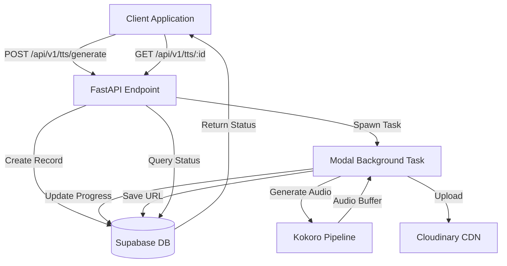
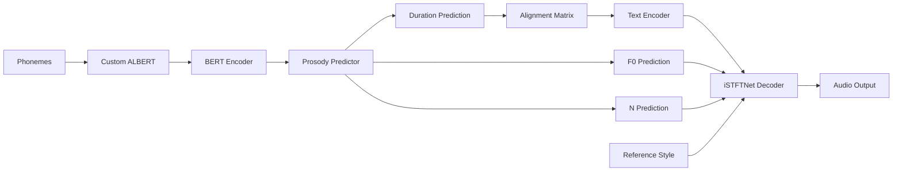
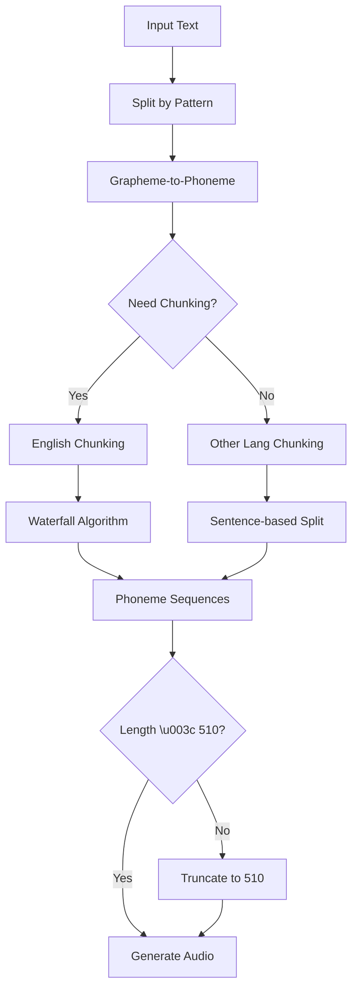
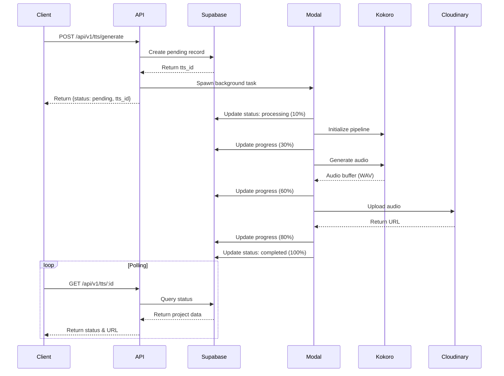

# Kokoro-82M TTS - Comprehensive Analysis

## Overview

Kokoro-82M is a high-quality Text-to-Speech (TTS) model integrated into the Creatorify AI Service. It provides multilingual speech synthesis with support for 9 languages and multiple voice options. The implementation uses Modal for serverless deployment and follows an asynchronous processing pattern.

## Architecture

### System Components



### Component Breakdown

#### 1. **API Layer** (`api/v1/tts.py`)
- **Purpose**: Handle HTTP requests and responses
- **Responsibilities**:
  - Validate incoming TTS requests
  - Create pending records in database
  - Spawn background processing tasks
  - Provide status polling endpoints
  - Manage CRUD operations for TTS projects

#### 2. **Service Layer** (`services/tts_service.py`)
- **Purpose**: Business logic for TTS generation
- **Responsibilities**:
  - Initialize Kokoro pipeline (lazy loading)
  - Manage language-specific pipelines
  - Generate audio from text
  - Convert audio to WAV format

#### 3. **Kokoro Core** (`infinitetalk/kokoro/`)
- **Purpose**: Core TTS model implementation
- **Components**:
  - `model.py`: Neural network model (KModel)
  - `pipeline.py`: Language-aware processing (KPipeline)
  - `modules.py`: Model components (ALBERT, Prosody Predictor)
  - `istftnet.py`: Audio decoder

#### 4. **Background Processing** (`app.py::process_tts_task`)
- **Purpose**: Asynchronous audio generation
- **Responsibilities**:
  - Execute TTS generation
  - Upload results to Cloudinary
  - Update database with progress
  - Handle errors and failures

## Technical Deep Dive

### 1. Kokoro Model Architecture

#### KModel (`infinitetalk/kokoro/model.py`)

The KModel is a PyTorch neural network module with the following components:

**Architecture Components:**



**Key Features:**
- **Model Size**: 82M parameters
- **Context Length**: 512 tokens (from ALBERT config)
- **Sample Rate**: 24,000 Hz
- **Architecture**:
  - Custom ALBERT for phoneme encoding
  - Prosody predictor for duration, F0, and N prediction
  - Text encoder for feature extraction
  - iSTFTNet decoder for high-quality audio synthesis

**Supported Models:**
- `hexgrad/Kokoro-82M` (v1.0) - Base model
- `hexgrad/Kokoro-82M-v1.1-zh` (v1.1) - Chinese-optimized

#### KPipeline (`infinitetalk/kokoro/pipeline.py`)

The KPipeline handles language-specific text processing:

**Supported Languages:**

| Code | Language | G2P Method | Notes |
|------|----------|------------|-------|
| `a` | American English | misaki[en] | Full chunking support |
| `b` | British English | misaki[en] | Full chunking support |
| `e` | Spanish | espeak-ng | Basic support |
| `f` | French | espeak-ng | Basic support |
| `h` | Hindi | espeak-ng | Basic support |
| `i` | Italian | espeak-ng | Basic support |
| `p` | Portuguese (BR) | espeak-ng | Basic support |
| `j` | Japanese | misaki[ja] | Requires misaki[ja] |
| `z` | Mandarin Chinese | misaki[zh] | Requires misaki[zh] |

**Text Processing Flow:**



**Chunking Strategy:**

1. **English (a, b)**:
   - Uses "waterfall" algorithm for intelligent chunking
   - Prioritizes breaking at: `!.?…` → `:;` → `,—`
   - Respects 510 phoneme limit
   - Preserves punctuation and whitespace

2. **Other Languages**:
   - Sentence-based chunking (400 char chunks)
   - Falls back to character-based if no sentence boundaries
   - Truncates to 510 phonemes if needed

### 2. Voice System

**Voice Format:**
- Stored as `.pt` files (PyTorch tensors)
- Contains style embeddings (256-dim)
- Located in `voices/` directory within model repo

**Voice Loading:**
- Lazy loading from HuggingFace Hub or local directory
- Supports voice blending (comma-separated voice names)
- Caching for performance

**Available Voices:**
- `af_heart`, `af_bella`, `af_jessica` (American Female)
- `am_michael`, `am_adam` (American Male)
- `bf_emma`, `bf_isabella` (British Female)
- `bm_george`, `bm_lewis` (British Male)
- And more...

### 3. Processing Pipeline

#### Asynchronous Workflow



#### Progress Stages

| Progress | Status | Description |
|----------|--------|-------------|
| 0% | `pending` | Job queued, not started |
| 10% | `processing` | Task spawned, initializing |
| 30% | `processing` | Generating audio with Kokoro |
| 60% | `processing` | Processing audio file |
| 80% | `processing` | Uploading to Cloudinary |
| 100% | `completed` | Generation complete, URL available |

### 4. Modal Integration

#### Container Image

```python
image = (
    modal.Image.debian_slim(python_version="3.11")
    .apt_install(["ffmpeg", "libsndfile1", "espeak-ng"])
    .pip_install([
        "kokoro==0.9.4",
        "misaki[en]",
        "soundfile",
        "torch",
        # ... other dependencies
    ])
)
```

#### Volume Management

**Model Volume** (`/models`):
- Stores Kokoro-82M model files
- Downloaded during initialization
- Persistent across function calls

**Output Volume** (`/outputs`):
- Stores generated audio files
- Organized by project type
- Optional backup storage

#### Background Task Function

```python
@app.function(
    image=image,
    volumes={MODEL_DIR: model_volume, OUTPUT_DIR: output_volume},
    secrets=[...],
    timeout=600  # 10 minutes
)
def process_tts_task(tts_id, text, voice, speed, lang_code):
    # 1. Initialize services
    # 2. Update status to processing
    # 3. Generate audio
    # 4. Upload to Cloudinary
    # 5. Update status to completed
```

## API Specification

### Endpoints

#### 1. Generate TTS
```http
POST /api/v1/tts/generate
Content-Type: application/json

{
  "text": "Hello, welcome to Creatorify AI.",
  "voice": "af_heart",
  "speed": 1.0,
  "lang_code": "a",
  "user_id": "user_123"
}
```

**Response:**
```json
{
  "tts_id": "550e8400-e29b-41d4-a716-446655440000",
  "user_id": "user_123",
  "text": "Hello, welcome to Creatorify AI.",
  "voice": "af_heart",
  "speed": 1.0,
  "lang_code": "a",
  "audio_url": null,
  "status": "pending",
  "progress": 0,
  "created_at": "2023-10-27T10:00:00Z"
}
```

#### 2. Get TTS Status
```http
GET /api/v1/tts/{tts_id}
```

**Response (Completed):**
```json
{
  "tts_id": "550e8400-e29b-41d4-a716-446655440000",
  "status": "completed",
  "progress": 100,
  "audio_url": "https://res.cloudinary.com/.../tts_uuid.wav",
  "text": "Hello, welcome to Creatorify AI.",
  "voice": "af_heart",
  "speed": 1.0,
  "lang_code": "a",
  "created_at": "2023-10-27T10:00:00Z"
}
```

#### 3. List TTS Projects
```http
GET /api/v1/tts/?user_id=user_123&limit=20
```

#### 4. Delete TTS Project
```http
DELETE /api/v1/tts/{tts_id}
```

## Database Schema

### `tts_projects` Table

| Column | Type | Description |
|--------|------|-------------|
| `id` | uuid | Primary key (tts_id) |
| `created_at` | timestamptz | Creation timestamp |
| `user_id` | text | User identifier |
| `text` | text | Input text |
| `voice` | text | Voice ID |
| `speed` | float | Speech speed (0.5-2.0) |
| `lang_code` | text | Language code |
| `audio_url` | text | Cloudinary URL (null until completed) |
| `status` | text | `pending`, `processing`, `completed`, `failed` |
| `progress` | integer | 0-100 |

## Performance Characteristics

### Generation Speed
- **Short text** (\u003c50 words): ~2-5 seconds
- **Medium text** (50-200 words): ~5-15 seconds
- **Long text** (\u003e200 words): ~15-60 seconds

### Resource Usage
- **CPU**: Minimal (GPU not required)
- **Memory**: ~2-4 GB for model
- **Storage**: ~500 MB for model files

### Limitations
- **Max phoneme length**: 510 characters per chunk
- **Timeout**: 600 seconds (10 minutes)
- **Concurrent requests**: Limited by Modal concurrency settings

## Error Handling

### Common Errors

1. **Model Initialization Failure**
   - Cause: Missing model files, CUDA issues
   - Solution: Check volume mount, verify model download

2. **Text Too Long**
   - Cause: Text exceeds chunking limits
   - Solution: Automatic chunking handles this

3. **Invalid Voice**
   - Cause: Voice file not found
   - Solution: Verify voice ID, check HuggingFace repo

4. **Upload Failure**
   - Cause: Cloudinary connection issues
   - Solution: Retry mechanism, check credentials

### Error Response Format
```json
{
  "detail": "Error message describing the issue"
}
```

## Best Practices

### 1. Text Input
- Use proper punctuation for natural pauses
- Split very long texts into multiple requests
- Use `\n` for paragraph breaks

### 2. Voice Selection
- Test different voices for your use case
- Consider blending voices for unique styles
- Match language code to voice language

### 3. Speed Control
- `0.5`: Very slow (for clarity)
- `1.0`: Normal speed (recommended)
- `1.5`: Fast (for quick narration)
- `2.0`: Very fast (may reduce quality)

### 4. Language Codes
- Use correct language code for best results
- English: `a` (American) or `b` (British)
- For other languages, ensure text matches language code

## Comparison with Chatterbox

| Feature | Kokoro-82M | Chatterbox |
|---------|------------|------------|
| **Languages** | 9 languages | English + Multilingual |
| **Voice Cloning** | ❌ No | ✅ Yes |
| **Pre-built Voices** | ✅ Yes (20+) | ❌ No |
| **GPU Required** | ❌ No | ✅ Yes (A10G) |
| **Generation Speed** | ⚡ Fast | 🐢 Slower |
| **Quality** | ⭐⭐⭐⭐ High | ⭐⭐⭐⭐⭐ Very High |
| **Use Case** | General TTS | Custom voices |
| **Cost** | 💰 Low | 💰💰 Higher |

## Use Cases

### 1. **Content Creation**
- Narration for videos
- Podcast generation
- Audiobook creation

### 2. **Accessibility**
- Screen readers
- Text-to-speech for visually impaired
- Language learning tools

### 3. **Customer Service**
- IVR systems
- Chatbot voices
- Automated announcements

### 4. **Gaming**
- NPC dialogue
- Dynamic narration
- Multilingual support

## Future Enhancements

### Potential Improvements
1. **Streaming Support**: Real-time audio streaming
2. **SSML Support**: Advanced speech markup
3. **Emotion Control**: Adjust emotional tone
4. **Voice Mixing**: Blend multiple voices dynamically
5. **Caching**: Cache frequently generated phrases
6. **Batch Processing**: Process multiple texts in one request

### Model Upgrades
- Support for Kokoro-82M v1.1 (improved Chinese)
- Integration with newer voice models
- Fine-tuning for specific domains

## Troubleshooting

### Issue: "Failed to initialize Kokoro TTS Pipeline"
**Solution:**
1. Check if model files are downloaded
2. Verify volume mount is correct
3. Check logs for specific error messages

### Issue: "Audio quality is poor"
**Solution:**
1. Reduce speed to 1.0 or lower
2. Check if voice matches language
3. Ensure text has proper punctuation

### Issue: "Generation timeout"
**Solution:**
1. Split text into smaller chunks
2. Increase timeout in Modal function
3. Check for infinite loops in text processing

## References

- **Kokoro Model**: [hexgrad/Kokoro-82M](https://huggingface.co/hexgrad/Kokoro-82M)
- **Misaki G2P**: [misaki library](https://github.com/hexgrad/misaki)
- **Modal Documentation**: [modal.com/docs](https://modal.com/docs)
- **Supabase**: [supabase.com](https://supabase.com)
- **Cloudinary**: [cloudinary.com](https://cloudinary.com)
