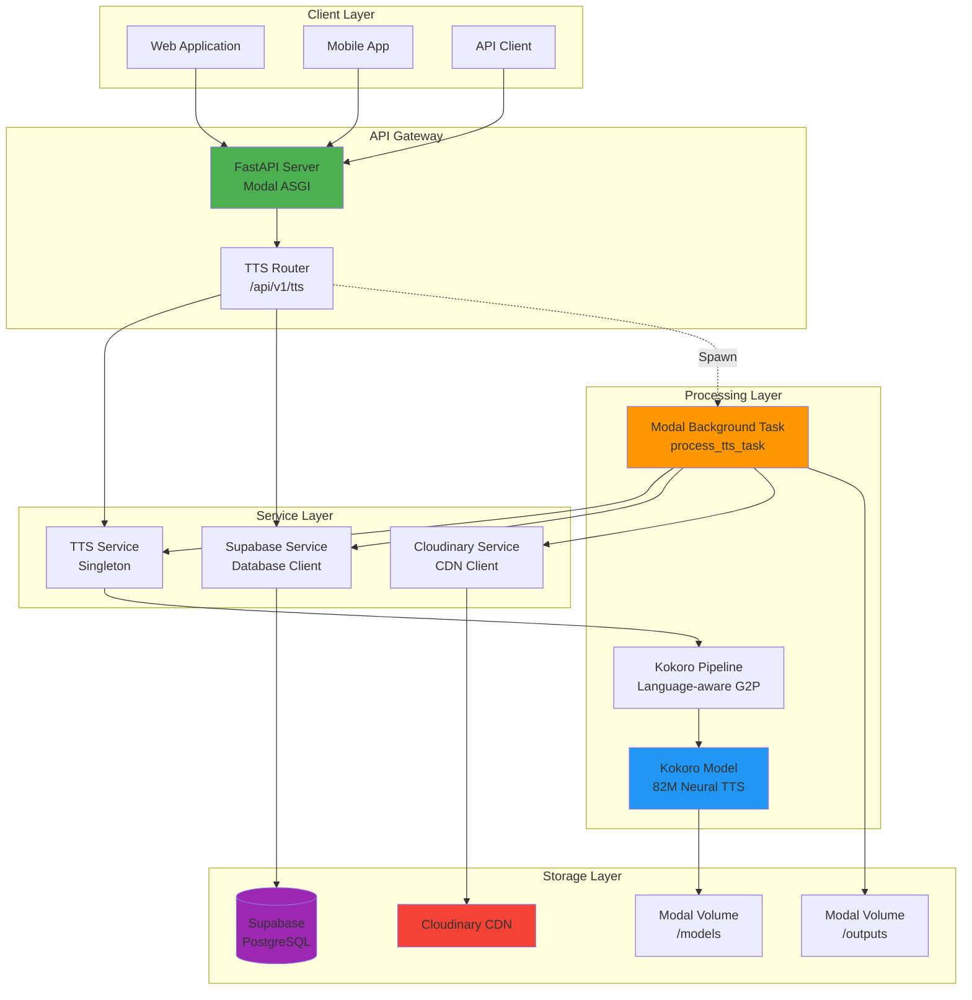
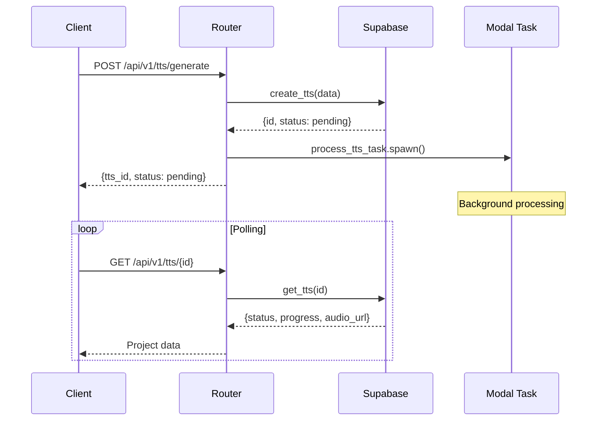
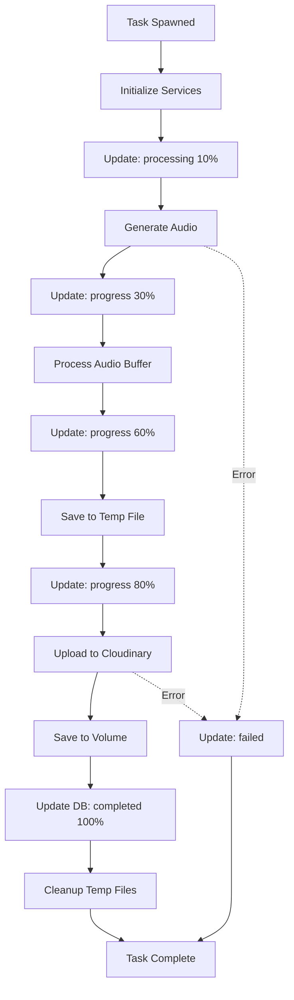
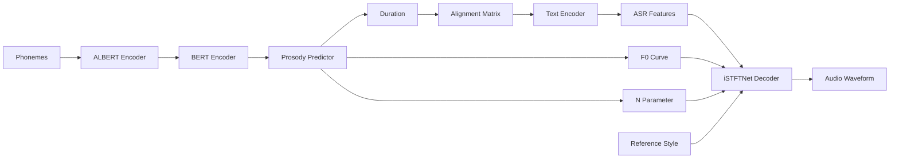
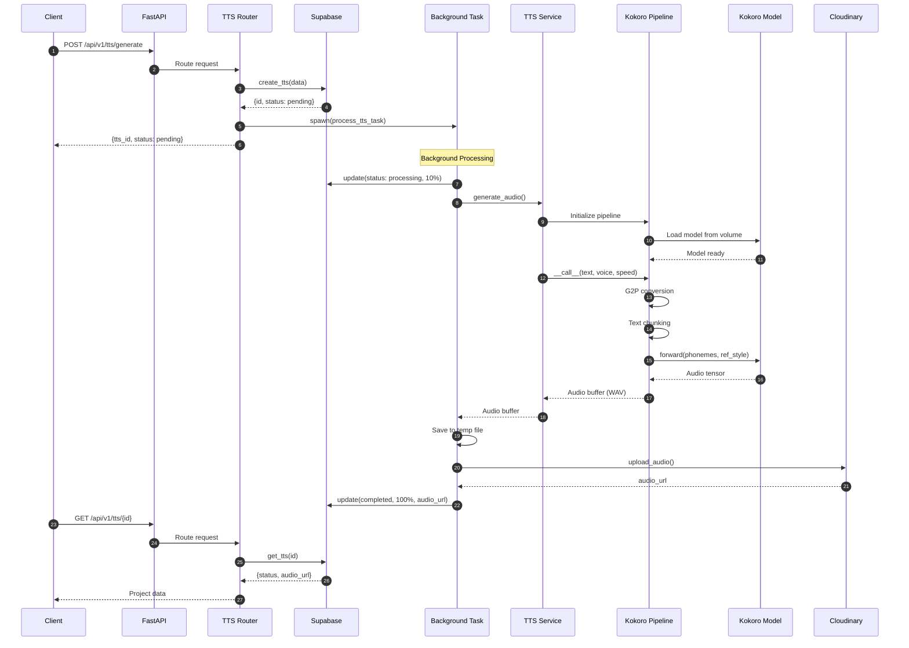
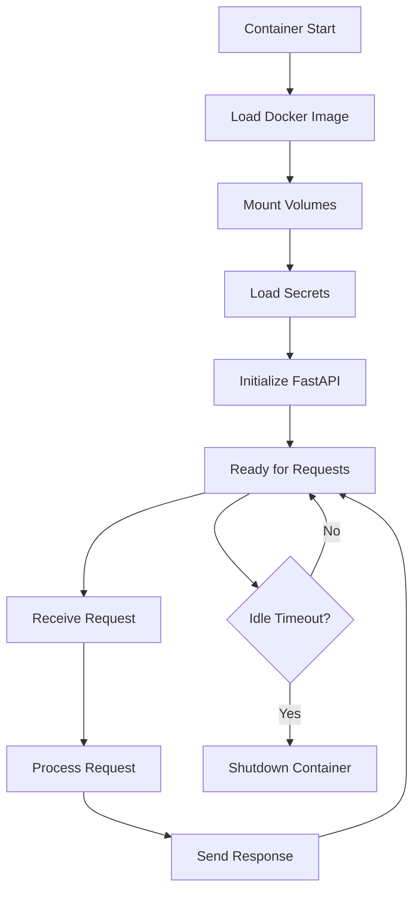

# Kokoro-82M TTS Microservice Architecture

## System Overview

The Kokoro-82M TTS microservice is a serverless, asynchronous text-to-speech system built on Modal.com. It provides high-quality speech synthesis across 9 languages with minimal infrastructure overhead.

## Architecture Diagram



## Component Details

### 1. API Gateway Layer

#### FastAPI Application
**File**: `app.py::fastapi_app()`

**Responsibilities**:
- HTTP request handling
- Route registration
- CORS configuration
- Authentication middleware
- Error handling

**Configuration**:
```python
@app.function(
    image=image,
    volumes={OUTPUT_DIR: output_volume, MODEL_DIR: model_volume},
    secrets=[
        modal.Secret.from_name("supabase-secrets"),
        modal.Secret.from_name("cloudinary-secrets"),
        modal.Secret.from_name("api-key-secret")
    ]
)
@modal.asgi_app()
def fastapi_app():
    web_app = FastAPI(title="Creatorify AI API", version="2.0.0")
    web_app.state.process_tts_task = process_tts_task
    web_app.include_router(tts.router, prefix="/api/v1/tts", tags=["tts"])
    return web_app
```

#### TTS Router
**File**: `api/v1/tts.py`

**Endpoints**:
- `POST /generate` - Create TTS project
- `GET /` - List TTS projects
- `GET /{tts_id}` - Get TTS status
- `DELETE /{tts_id}` - Delete TTS project

**Request Flow**:


### 2. Service Layer

#### TTS Service
**File**: `services/tts_service.py`

**Design Pattern**: Singleton

**Key Methods**:
```python
class TTSService:
    def __init__(self):
        # Lazy initialization
        self._pipeline = None
        self._current_lang_code = None
    
    def _initialize_pipeline(self, lang_code: str):
        # Initialize Kokoro pipeline for specific language
        from kokoro import KPipeline
        self._pipeline = KPipeline(
            lang_code=lang_code,
            repo_id='/models/tts/Kokoro-82M'
        )
    
    def generate_audio(self, text, voice, speed, lang_code) -> io.BytesIO:
        # Generate audio and return WAV buffer
        if self._pipeline is None or self._current_lang_code != lang_code:
            self._initialize_pipeline(lang_code)
        
        generator = self._pipeline(text, voice=voice, speed=speed)
        audios = [audio for _, _, audio in generator if audio is not None]
        full_audio = torch.cat(audios, dim=0)
        
        buffer = io.BytesIO()
        sf.write(buffer, full_audio.numpy(), 24000, format='WAV')
        return buffer
```

**Features**:
- Lazy pipeline initialization
- Language switching support
- Audio concatenation for long texts
- WAV format output (24kHz)

#### Supabase Service
**File**: `services/supabase_service.py`

**TTS-Related Methods**:
```python
class SupabaseService:
    def create_tts(self, tts_data, audio_url, user_id) -> dict
    def update_tts(self, tts_id, updates) -> dict
    def get_tts(self, tts_id) -> dict
    def list_tts(self, user_id, limit) -> list
    def delete_tts(self, tts_id) -> bool
```

**Database Schema**:
```sql
CREATE TABLE tts_projects (
    id UUID PRIMARY KEY DEFAULT uuid_generate_v4(),
    created_at TIMESTAMPTZ DEFAULT NOW(),
    user_id TEXT NOT NULL,
    text TEXT NOT NULL,
    voice TEXT NOT NULL,
    speed FLOAT DEFAULT 1.0,
    lang_code TEXT DEFAULT 'a',
    audio_url TEXT,
    status TEXT DEFAULT 'pending',
    progress INTEGER DEFAULT 0
);
```

#### Cloudinary Service
**File**: `services/cloudinary_service.py`

**Audio Upload**:
```python
class CloudinaryService:
    def upload_audio(self, file_path, public_id) -> str:
        # Upload audio file to Cloudinary
        # Returns public URL
```

### 3. Processing Layer

#### Background Task
**File**: `app.py::process_tts_task()`

**Modal Configuration**:
```python
@app.function(
    image=image,
    volumes={MODEL_DIR: model_volume, OUTPUT_DIR: output_volume},
    secrets=[
        modal.Secret.from_name("supabase-secrets"),
        modal.Secret.from_name("cloudinary-secrets")
    ],
    timeout=600  # 10 minutes
)
def process_tts_task(tts_id, text, voice, speed, lang_code):
    # Background processing logic
```

**Processing Steps**:


**Error Handling**:
```python
try:
    # Processing logic
    db.update_tts(tts_id, {"status": "completed", "progress": 100})
except Exception as e:
    print(f"Error in TTS task {tts_id}: {e}")
    db.update_tts(tts_id, {"status": "failed"})
    raise e
```

#### Kokoro Pipeline
**File**: `infinitetalk/kokoro/pipeline.py`

**Class**: `KPipeline`

**Responsibilities**:
- Language-specific G2P (Grapheme-to-Phoneme)
- Text chunking and segmentation
- Voice loading and management
- Audio generation orchestration

**Language Support**:
```python
LANG_CODES = {
    'a': 'American English',  # misaki[en]
    'b': 'British English',   # misaki[en]
    'e': 'Spanish',           # espeak-ng
    'f': 'French',            # espeak-ng
    'h': 'Hindi',             # espeak-ng
    'i': 'Italian',           # espeak-ng
    'p': 'Portuguese (BR)',   # espeak-ng
    'j': 'Japanese',          # misaki[ja]
    'z': 'Mandarin Chinese',  # misaki[zh]
}
```

**Text Processing**:
```python
def __call__(self, text, voice, speed, split_pattern):
    # 1. Split text by pattern (e.g., \n+)
    # 2. Apply G2P to convert text -> phonemes
    # 3. Chunk phonemes (max 510 chars)
    # 4. Generate audio for each chunk
    # 5. Yield (graphemes, phonemes, audio)
```

#### Kokoro Model
**File**: `infinitetalk/kokoro/model.py`

**Class**: `KModel`

**Architecture**:
```python
class KModel(torch.nn.Module):
    def __init__(self, repo_id, config, model):
        self.bert = CustomAlbert(...)           # Phoneme encoding
        self.bert_encoder = Linear(...)         # Feature projection
        self.predictor = ProsodyPredictor(...)  # Duration, F0, N
        self.text_encoder = TextEncoder(...)    # Text features
        self.decoder = Decoder(...)             # iSTFTNet audio decoder
```

**Forward Pass**:


### 4. Storage Layer

#### Modal Volumes

**Model Volume** (`/models`):
```python
model_volume = modal.Volume.from_name(
    "creatorify-models-vol",
    create_if_missing=True
)
```

**Structure**:
```
/models/
└── tts/
    └── Kokoro-82M/
        ├── config.json
        ├── kokoro-v1_0.pth
        └── voices/
            ├── af_heart.pt
            ├── af_bella.pt
            ├── am_michael.pt
            └── ...
```

**Output Volume** (`/outputs`):
```python
output_volume = modal.Volume.from_name(
    "creatorify-outputs-vol",
    create_if_missing=True
)
```

**Structure**:
```
/outputs/
└── tts/
    ├── tts_uuid1.wav
    ├── tts_uuid2.wav
    └── ...
```

#### Supabase Database

**Connection**:
```python
url = os.environ.get("SUPABASE_URL")
key = os.environ.get("SUPABASE_SERVICE_ROLE")
client = create_client(url, key)
```

**Table**: `tts_projects`

**Indexes**:
- Primary key on `id`
- Index on `user_id` for filtering
- Index on `created_at` for sorting

#### Cloudinary CDN

**Configuration**:
```python
cloudinary.config(
    cloud_name=os.environ.get("CLOUDINARY_CLOUD_NAME"),
    api_key=os.environ.get("CLOUDINARY_API_KEY"),
    api_secret=os.environ.get("CLOUDINARY_API_SECRET")
)
```

**Upload Pattern**:
```python
public_id = f"tts_{uuid.uuid4()}"
result = cloudinary.uploader.upload(
    file_path,
    resource_type="video",  # For audio files
    public_id=public_id,
    folder="creatorify/tts"
)
audio_url = result['secure_url']
```

## Data Flow

### Complete Request Flow



## Deployment Architecture

### Modal Deployment

**Container Lifecycle**:


**Scaling**:
- **Auto-scaling**: Based on request volume
- **Cold start**: ~2-5 seconds (image cached)
- **Warm instances**: Instant response
- **Concurrency**: Configurable per function

### Environment Variables

**Required Secrets**:
```bash
# Supabase
SUPABASE_URL=https://xxx.supabase.co
SUPABASE_SERVICE_ROLE=eyJxxx...

# Cloudinary
CLOUDINARY_CLOUD_NAME=xxx
CLOUDINARY_API_KEY=xxx
CLOUDINARY_API_SECRET=xxx

# API Authentication (optional)
API_KEY=xxx
```

## Performance Optimization

### 1. Model Caching
- Models loaded once per container
- Singleton pattern for TTS service
- Volume persistence for model files

### 2. Pipeline Reuse
- Language-specific pipelines cached
- Voice embeddings cached after first load
- Lazy initialization to save memory

### 3. Concurrent Processing
```python
# Multiple background tasks can run in parallel
process_tts_task.spawn(...)  # Non-blocking
process_tts_task.spawn(...)  # Non-blocking
```

### 4. Volume Optimization
- Model volume: Read-only, shared across instances
- Output volume: Write-only, committed periodically
- Reduces download time on cold starts

## Monitoring & Observability

### Logging Strategy

**Application Logs**:
```python
print(f"Processing TTS task {tts_id}...")
print(f"Generating audio for {tts_id}...")
print(f"Uploading to Cloudinary for {tts_id}...")
print(f"TTS task {tts_id} completed successfully.")
```

**Error Logs**:
```python
print(f"Error in TTS task {tts_id}: {e}")
import traceback
traceback.print_exc()
```

### Progress Tracking

**Database-Driven**:
```python
# Update progress at key milestones
db.update_tts(tts_id, {"progress": 10})  # Started
db.update_tts(tts_id, {"progress": 30})  # Generating
db.update_tts(tts_id, {"progress": 60})  # Processing
db.update_tts(tts_id, {"progress": 80})  # Uploading
db.update_tts(tts_id, {"progress": 100}) # Completed
```

### Metrics to Monitor

1. **Request Metrics**:
   - Requests per minute
   - Success rate
   - Error rate

2. **Performance Metrics**:
   - Average generation time
   - P95/P99 latency
   - Queue depth

3. **Resource Metrics**:
   - Container count
   - Memory usage
   - Volume storage

4. **Business Metrics**:
   - Total audio generated (minutes)
   - Popular voices
   - Language distribution

## Security Considerations

### 1. Authentication
```python
# API Key validation (if implemented)
async def verify_api_key(api_key: str = Header(...)):
    if api_key != os.environ.get("API_KEY"):
        raise HTTPException(status_code=401)
```

### 2. Input Validation
```python
class TTSRequest(BaseModel):
    text: str  # Required, validated by Pydantic
    voice: str = "af_heart"
    speed: float = Field(default=1.0, ge=0.5, le=2.0)
    lang_code: str = Field(default="a", regex="^[abefhipjz]$")
```

### 3. Secret Management
- Secrets stored in Modal Secret Store
- Never logged or exposed in responses
- Rotated periodically

### 4. Resource Limits
```python
@app.function(
    timeout=600,  # Max 10 minutes per task
    memory=4096,  # Max 4GB memory
)
```

## Disaster Recovery

### Backup Strategy

1. **Database**: Supabase automatic backups
2. **Model Files**: HuggingFace Hub as source of truth
3. **Generated Audio**: Cloudinary CDN (permanent storage)
4. **Volume Backups**: Modal volume snapshots

### Failure Scenarios

**Scenario 1: Model Download Failure**
```python
# Fallback to HuggingFace Hub
if not os.path.exists(local_model_path):
    repo_id = 'hexgrad/Kokoro-82M'
```

**Scenario 2: Cloudinary Upload Failure**
```python
# Retry mechanism (implement if needed)
# Keep audio in volume as backup
```

**Scenario 3: Database Connection Failure**
```python
# Graceful degradation
if not self.client:
    return {"id": "mock-id", "status": "queued"}
```

## Cost Optimization

### 1. Compute Costs
- **CPU-only**: No GPU required (lower cost)
- **Auto-scaling**: Pay only for active time
- **Idle timeout**: Containers shut down when unused

### 2. Storage Costs
- **Model volume**: One-time download, shared
- **Output volume**: Periodic cleanup of old files
- **Cloudinary**: Free tier for development

### 3. Network Costs
- **Cloudinary CDN**: Efficient delivery
- **Modal egress**: Minimal (only final upload)

## Future Enhancements

### 1. Streaming Support
```python
@router.get("/stream/{tts_id}")
async def stream_audio(tts_id: str):
    # Stream audio as it's generated
    # Reduce perceived latency
```

### 2. Caching Layer
```python
# Cache frequently requested phrases
cache_key = hashlib.md5(f"{text}:{voice}:{speed}".encode()).hexdigest()
if cache_key in redis:
    return cached_audio_url
```

### 3. Batch Processing
```python
@router.post("/batch")
async def batch_generate(requests: List[TTSRequest]):
    # Process multiple requests efficiently
```

### 4. Webhooks
```python
class TTSRequest(BaseModel):
    # ... existing fields
    webhook_url: Optional[str] = None  # Notify on completion
```

## Conclusion

The Kokoro-82M TTS microservice is a robust, scalable solution for high-quality speech synthesis. Its serverless architecture on Modal provides:

- ✅ **Scalability**: Auto-scaling based on demand
- ✅ **Reliability**: Fault-tolerant with proper error handling
- ✅ **Performance**: Fast generation with model caching
- ✅ **Cost-effective**: Pay-per-use pricing
- ✅ **Maintainability**: Clean separation of concerns

The asynchronous processing pattern ensures responsive API behavior while handling long-running TTS generation tasks efficiently.
